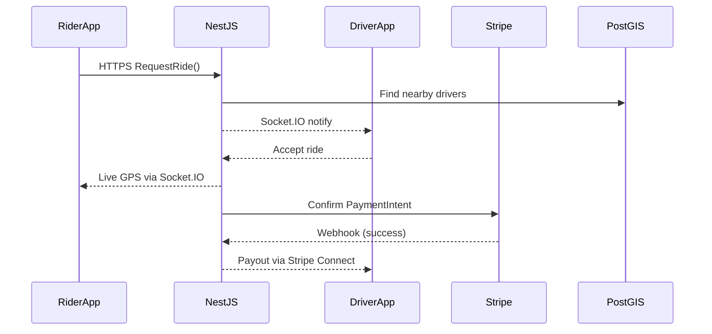

# Ride‑Hailing Platform ‑ High‑Level Architecture & Use‑Case Catalogue

---

## 1. Mobile Apps

**Android UI:** Jetpack Compose (Kotlin)  
**iOS UI:** SwiftUI (Swift)  
**Shared Business Logic:** Kotlin Multiplatform Mobile (KMM) or a shared Kotlin library for data models, networking, and validation  

**Maps & Geolocation**

* Google Maps SDK (Android) / MapKit (iOS)  
* Geofencing & background location via **AndroidX Location** + **CoreLocation**

---

## 2. Real‑Time Updates

* **Protocol:** WebSockets  
* **Library:** Socket.IO (client & server)

```
Driver app streams GPS  ➔  NestJS
NestJS broadcasts nearby drivers  ➔  rider apps
```

---

## 3. Backend API & Business Logic

* **Runtime & Framework:** Node.js + NestJS (TypeScript)  
* **API Style:** REST (NestJS Controllers) + optional GraphQL (Apollo)

**Modules**

| Domain | Key Responsibilities |
|--------|----------------------|
| Auth & Security | JWT + Passport.js or OAuth2 with Auth0/Keycloak |
| Rides | Ride‑request flows, surge pricing, cancellation rules |
| Users | Profiles, ratings, KYC for drivers |
| Notifications | Integrate FCM / APNs for push |

---

## 4. Payments

* **Processor:** Stripe  

**Flow**

1. Rider enters card via **Stripe Mobile SDK**.  
2. NestJS backend captures **PaymentIntent** & handles webhooks for successful charges.  
3. Driver payouts via **Stripe Connect**.

---

## 5. Admin Dashboard & Web Portal

* **Framework:** Next.js (React + TypeScript)  

**Features**

* Server‑Side Rendering for faster load & SEO  
* NextAuth or Auth0 integration  
* API routes for quick reports (rides per hour, earnings)  
* Realtime metrics via WebSocket or polling  

---

## 6. Data Storage & Caching

| Purpose           | Technology                            |
|-------------------|---------------------------------------|
| Primary Database  | **PostgreSQL** + **PostGIS** (geospatial queries) |
| Cache / Fast Reads| **Redis** (location lookups, rate‑limiting) |
| Message Queue     | **RabbitMQ** or **Kafka** (async tasks e.g., receipts, emails) |

---

## 7. Infrastructure & DevOps

* **Containerization:** Docker  
* **Orchestration:** Kubernetes (EKS/GKE/AKS) or Docker Compose for MVP  
* **CI/CD:** GitHub Actions or GitLab CI  
* **Cloud Provider:** AWS / GCP / Azure  

**Monitoring & Logging**

* Prometheus + Grafana (metrics)  
* ELK Stack or Datadog (application logs)  

---

## 8. Security & Compliance

* **Transport:** TLS everywhere  
* **Data‑at‑Rest:** AES‑256 encryption for sensitive fields (driver documents, payment tokens)  
* **WAF / Firewall:** Cloudflare or AWS WAF  
* **Rate Limiting:** Redis‑backed token bucket  

---

## 9. How It Flows — End‑to‑End



Admins log into the **Next.js** dashboard to view live map overlays, logs, and earnings.

---

# Detailed Use‑Case Catalogue

> Click to expand individual sections.

<details>
<summary><strong>A. Passenger (Rider) Use Cases (16)</strong></summary>

| ID | Title |
|----|-------------------------------------------|
| A.1 | [Register / Sign Up](use-cases/A.%20Passenger%20%28Rider%29%20Use%20Cases%20%2816%29/A.1%20Register%20-%20Sign%20Up.md) |
| A.2 | [Login / Authenticate](use-cases/A.%20Passenger%20%28Rider%29%20Use%20Cases%20%2816%29/A.2%20Login%20-%20Authenticate.md) |
| A.3 | [Forgot / Reset Password](use-cases/A.%20Passenger%20%28Rider%29%20Use%20Cases%20%2816%29/A.3%20Forgot%20-%20Reset%20Password%20%28only%20if%20email-password%20login%20enabled%29.md) |
| A.4 | [Edit Profile & Preferences](use-cases/A.%20Passenger%20%28Rider%29%20Use%20Cases%20%2816%29/A.4%20Edit%20Profile%20%26%20Preferences.md) |
| A.5 | [Request a Ride](use-cases/A.%20Passenger%20%28Rider%29%20Use%20Cases%20%2816%29/A.5%20Request%20a%20Ride.md) |
| A.6 | [Wait for Driver (Ads + Progress Bar)](use-cases/A.%20Passenger%20%28Rider%29%20Use%20Cases%20%2816%29/A.6%20Wait%20for%20Driver%20%28Ads%20%2B%20Progress%20Bar%29.md) |
| A.7 | [Track Driver & Trip Status](use-cases/A.%20Passenger%20%28Rider%29%20Use%20Cases%20%2816%29/A.7%20Track%20Driver%20%26%20Trip%20Status.md) |
| A.8 | [Cancel Ride](use-cases/A.%20Passenger%20%28Rider%29%20Use%20Cases%20%2816%29/A.8%20Cancel%20Ride.md) |
| A.9 | [Rate & Review Driver](use-cases/A.%20Passenger%20%28Rider%29%20Use%20Cases%20%2816%29/A.9%20%E2%80%93%20Rate%20%26%20Review%20Driver.md) |
| A.10 | [View Ride History](use-cases/A.%20Passenger%20%28Rider%29%20Use%20Cases%20%2816%29/A.10%20%E2%80%93%20View%20Ride%20History.md) |
| A.11 | [Safety Centre (SOS & Share Trip)](use-cases/A.%20Passenger%20%28Rider%29%20Use%20Cases%20%2816%29/A.11%20Safety%20Centre%20%28SOS%20%26%20Share%20Trip%29.md) |
| A.12 | [In‑App Support Chat (Rider)](use-cases/A.%20Passenger%20%28Rider%29%20Use%20Cases%20%2816%29/A.12%20In-App%20Support%20Chat%20%28Rider%29.md) |
| A.13 | [Manage Favourite Locations](use-cases/A.%20Passenger%20%28Rider%29%20Use%20Cases%20%2816%29/A.13%20%E2%80%93%20Manage%20Favourite%20Locations.md) |
| A.14 | [Modify Destination Before Pickup](use-cases/A.%20Passenger%20%28Rider%29%20Use%20Cases%20%2816%29/A.14%20%E2%80%93%20Modify%20Destination%20Before%20Pickup%20%28MVP%29.md) |
| A.15 | [Share Live Trip Link](use-cases/A.%20Passenger%20%28Rider%29%20Use%20Cases%20%2816%29/A.15%20Share%20Live%20Trip%20Link%20%28MVP%29.md) |
| A.16 | [Manage Notification Preferences](use-cases/A.%20Passenger%20%28Rider%29%20Use%20Cases%20%2816%29/A.16%20Manage%20Notification%20Preferences.md) |

</details>

<details>
<summary><strong>B. Driver Use Cases (13)</strong></summary>

| ID | Title |
|----|-----------------------------------|
| B.1 | [Driver Onboarding & Vehicle Setup](use-cases/B.%20Driver%20Use%20Cases%20%2813%29/B.1%20Driver%20Onboarding%20%26%20Vehicle%20Setup%20%28MVP%29.md) |
| B.2 | [Go Online / Offline](use-cases/B.%20Driver%20Use%20Cases%20%2813%29/B.2%20Go%20Online%20-%20Offline%20%28MVP%29.md) |
| B.3 | [Accept / Decline Ride](use-cases/B.%20Driver%20Use%20Cases%20%2813%29/B.3%20Accept%20-%20Decline%20Ride%20%28MVP%29.md) |
| B.4 | [Navigate to Pickup & Start Trip](use-cases/B.%20Driver%20Use%20Cases%20%2813%29/B.4%20Navigate%20to%20Pickup%20%26%20Start%20Trip.md) |
| B.5 | [Complete Trip & End Ride](use-cases/B.%20Driver%20Use%20Cases%20%2813%29/B.5%20Complete%20Trip%20%26%20End%20Ride%20%28MVP%29.md) |
| B.6 | [Earnings Dashboard (Distance‑Only)](use-cases/B.%20Driver%20Use%20Cases%20%2813%29/B.6%20Earnings%20Dashboard%20%28Distance-Only%29.md) |
| B.7 | [View Ride History & Filters](use-cases/B.%20Driver%20Use%20Cases%20%2813%29/B.7%20%E2%80%93%20View%20Ride%20History%20%26%20Filters%20.md) |
| B.8 | [Profile & Document Management](use-cases/B.%20Driver%20Use%20Cases%20%2813%29/B.8%20Profile%20%26%20Document%20Management.md) |
| B.9 | [In‑App Support Chat (Driver)](use-cases/B.%20Driver%20Use%20Cases%20%2813%29/B.9%20In-App%20Support%20Chat%20%28Driver%29.md) |
| B.10 | [Change Password / MFA Recovery](use-cases/B.%20Driver%20Use%20Cases%20%2813%29/B.10%20Change%20Password%20-%20MFA%20Recovery.md) |
| B.11 | [Safety Incident Reporting](use-cases/B.%20Driver%20Use%20Cases%20%2813%29/B.11%20Safety%20Incident%20Reporting.md) |
| B.12 | [Rate & Review Rider](use-cases/B.%20Driver%20Use%20Cases%20%2813%29/B.12%20Rate%20%26%20Review%20Rider.md) |
| B.13 | [Export Distance Log (CSV)](use-cases/B.%20Driver%20Use%20Cases%20%2813%29/B.13%20Export%20Distance%20Log%20%28CSV%29.md) |

</details>

<details>
<summary><strong>C. Admin / Back‑Office Use Cases (21)</strong></summary>

| ID | Title |
|----|-----------------------------------------------------|
| C.1 | [Approve / Reject Driver Applications](use-cases/C.%20Admin%20-Back-Office%20Use%20Cases%20%2821%29/C.1%20Approve-%20Reject%20Driver%20Applications.md) |
| C.2 | [Show / Hide Driver Details to Clients](use-cases/C.%20Admin%20-Back-Office%20Use%20Cases%20%2821%29/C.2%20Show%20-%20Hide%20Driver%20Details%20to%20Clients.md) |
| C.3 | [Assign Driver Manually / Forward to Fleet](use-cases/C.%20Admin%20-Back-Office%20Use%20Cases%20%2821%29/C.3%20Assign%20Driver%20Manually-%20Forward%20to%20Fleet.md) |
| C.4 | [Configure Pricing Parameters (base + per‑km + per‑minute)](use-cases/C.%20Admin%20-Back-Office%20Use%20Cases%20%2821%29/C.4%20Configure%20Pricing%20Parameters.md) |
| C.5 | [Enable / Disable Auto‑Assignment](use-cases/C.%20Admin%20-Back-Office%20Use%20Cases%20%2821%29/C.5%20Enable%20-%20Disable%20Auto-Assignment.md) |
| C.6 | [Resolve Disputes & Support Tickets](use-cases/C.%20Admin%20-Back-Office%20Use%20Cases%20%2821%29/C.6%20Resolve%20Disputes%20%26%20Support%20Tickets.md) |
| C.7 | [Promotion & Campaign Management](use-cases/C.%20Admin%20-Back-Office%20Use%20Cases%20%2821%29/C.7%20Promotion%20%26%20Campaign%20Management.md) |
| C.8 | [Block‑List Management](use-cases/C.%20Admin%20-Back-Office%20Use%20Cases%20%2821%29/C.8%20Block-List%20Management.md) |
| C.9 | [Spam Filtering & Content Moderation](use-cases/C.%20Admin%20-Back-Office%20Use%20Cases%20%2821%29/C.9%20Spam%20Filtering%20%26%20Content%20Moderation.md) |
| C.10 | [Enhanced Support & Ticket Workflows](use-cases/C.%20Admin%20-Back-Office%20Use%20Cases%20%2821%29/C.10%20Enhanced%20Support%20%26%20Ticket%20Workflows.md) |
| C.11 | [CRUD Admin Accounts & Roles](use-cases/C.%20Admin%20-Back-Office%20Use%20Cases%20%2821%29/C.11%20CRUD%20Admin%20Accounts%20%26%20Roles.md) |
| C.12 | [Content Management (Blog / FAQ / Banners)](use-cases/C.%20Admin%20-Back-Office%20Use%20Cases%20%2821%29/C.12%20Content%20Management%20%28Blog%20-FAQ%20-%20Banners%29.md) |
| C.13 | [Analytics & Reports](use-cases/C.%20Admin%20-Back-Office%20Use%20Cases%20%2821%29/C.13%20Analytics%20%26%20Reports.md) |
| C.14 | [System Settings & Security](use-cases/C.%20Admin%20-Back-Office%20Use%20Cases%20%2821%29/C.14%20System%20Settings%20%26%20Security.md) |
| C.15 | [Suspend / Reinstate Driver](use-cases/C.%20Admin%20-Back-Office%20Use%20Cases%20%2821%29/C.15%20Suspend%20-%20Reinstate%20Driver.md) |
| C.16 | [GDPR Data‑Erasure Workflow](use-cases/C.%20Admin%20-Back-Office%20Use%20Cases%20%2821%29/C.16%20GDPR%20Data-Erasure%20Workflow.md) |
| C.17 | [Audit Log & Access Review](use-cases/C.%20Admin%20-Back-Office%20Use%20Cases%20%2821%29/C.17%20Audit%20Log%20%26%20Access%20Review.md) |
| C.18 | [Configure Retention Windows](use-cases/C.%20Admin%20-Back-Office%20Use%20Cases%20%2821%29/C.18%20Configure%20Retention%20Windows.md) |
| C.19 | [System Health & Alerting](use-cases/C.%20Admin%20-Back-Office%20Use%20Cases%20%2821%29/C.19%20System%20Health%20%26%20Alerting.md) |
| C.20 | [Role & Permission Templates](use-cases/C.%20Admin%20-Back-Office%20Use%20Cases%20%2821%29/C.20%20Role%20%26%20Permission%20Templates.md) |
| C.21 | [Generate & Schedule Reports](use-cases/C.%20Admin%20-Back-Office%20Use%20Cases%20%2821%29/C.21%20Generate%20%26%20Schedule%20Reports.md) |

</details>

<details>
<summary><strong>D. Public Website / PWA Use Cases (4)</strong></summary>

| ID | Title |
|----|----------------------------|
| D.1 | [Browse Marketing Content](use-cases/D.%20Public%20Website%20-%20PWA%20Use%20Cases%20%284%29/D.1%20Browse%20Marketing%20Content.md) |
| D.2 | [Web‑Booking Widget](use-cases/D.%20Public%20Website%20-%20PWA%20Use%20Cases%20%284%29/D.2%20Web-Booking%20Widget.md) |
| D.3 | [Install PWA & Receive Push](use-cases/D.%20Public%20Website%20-%20PWA%20Use%20Cases%20%284%29/D.3%20Install%20PWA%20%26%20Receive%20Push.md) |
| D.4 | [Handle 404 & Offline States](use-cases/D.%20Public%20Website%20-%20PWA%20Use%20Cases%20%284%29/D.4%20Handle%20404%20%26%20Offline%20States.md) |

</details>

<details>
<summary><strong>E. Driver Portal (Web) Use Cases (8)</strong></summary>

| ID | Title |
|----|----------------------------------|
| E.1 | [Login & MFA](use-cases/E.%20Driver%20Portal%20%28Web%29%20Use%20Cases%20%288%29/E.1%20Login%20%26%20MFA.md) |
| E.2 | [Profile & Document Management](use-cases/E.%20Driver%20Portal%20%28Web%29%20Use%20Cases%20%288%29/E.2%20Profile%20%26%20Document%20Management.md) |
| E.3 | [Availability Scheduling](use-cases/E.%20Driver%20Portal%20%28Web%29%20Use%20Cases%20%288%29/E.3%20Availability%20Scheduling.md) |
| E.4 | [View Ride History & Filters](use-cases/E.%20Driver%20Portal%20%28Web%29%20Use%20Cases%20%288%29/E.4%20View%20Ride%20History%20%26%20Filters.md) |
| E.5 | [Earnings Dashboard](use-cases/E.%20Driver%20Portal%20%28Web%29%20Use%20Cases%20%288%29/E.5%20Earnings%20Dashboard%20%28distance-only%29.md) |
| E.6 | [Support Centre](use-cases/E.%20Driver%20Portal%20%28Web%29%20Use%20Cases%20%288%29/E.6%20Support%20Centre.md) |
| E.7 | [Two‑Factor Recovery](use-cases/E.%20Driver%20Portal%20%28Web%29%20Use%20Cases%20%288%29/E.7%20Two-Factor%20Recovery.md) |
| E.8 | [Download & Print Documents](use-cases/E.%20Driver%20Portal%20%28Web%29%20Use%20Cases%20%288%29/E.8%20Download%20%26%20Print%20Documents.md) |

</details>

<details>
<summary><strong>F. Cross‑Cutting / System‑Wide Use Cases (3)</strong></summary>

| ID | Title |
|----|-----------------------------------------------------------|
| F.1 | [Localization / Language Switch](use-cases/F.%20Cross-Cutting%20-%20System-Wide%20Use%20Cases%20%283%29/F.1%20Localization%20-%20Language%20Switch.md) |
| F.2 | [Accessibility Settings (contrast, font, screen‑reader)](use-cases/F.%20Cross-Cutting%20-%20System-Wide%20Use%20Cases%20%283%29/F.2%20Accessibility%20Settings%20%28contrast%2C%20font%2C%20screen-reader%29.md) |
| F.3 | [Notifications Center (view & dismiss past pushes)](use-cases/F.%20Cross-Cutting%20-%20System-Wide%20Use%20Cases%20%283%29/F.3%20Notifications%20Center%20%28view%20%26%20dismiss%20past%20pushes%29.md) |

</details>

---

# Suggested Component‑Level Diagram Modules

Below is a concise list of logical modules that often appear in component diagrams for large‑scale ride‑hailing systems. Each module can map to one or more microservices depending on deployment strategy.

<details>
<summary><strong>Component Diagram Modules</strong></summary>

1. **Mobile Apps ↔ API Gateway** — Passenger & Driver apps, API‑Gateway façade, rate‑limiting, JWT injection  
2. **Authentication & Identity** — Auth service, MFA, password reset, social‑login adapters  
3. **User Profile & Preferences** — Profile service, favorites, notification settings, GDPR store  
4. **Ride Request & Matching** — Ride service, matching engine, surge calculator, ETA/maps adapter  
5. **Driver Dispatch & Navigation** — Driver status service, route‑planner, telemetry collector  
6. **Trip Lifecycle Management** — State‑machine, odometer tracker, cancellation handler  
7. **Payment, Pricing & Payouts** — Fare calculator, promo/discount engine, payment gateway, driver wallet  
8. **Rating & Feedback** — Rating service, sentiment filter, reputation scorer  
9. **Notification Delivery** — Push gateway, SMS/email adapters, templating service  
10. **Support & Ticketing** — Ticket service, chatbot, agent console, SLA timer  
11. **Admin / Back‑Office Portal** — RBAC layer, driver‑approval workflow, content CMS  
12. **Analytics & Reporting** — Event sink, OLAP store, dashboard renderer, export scheduler  
13. **Audit & Compliance** — Audit log, access‑review tool, GDPR erasure workflow  
14. **Configuration & Pricing Management** — Feature‑flag service, pricing rule store, dynamic config API  
15. **Promotion & Campaign Manager** — Voucher generator, segmentation engine, campaign scheduler  
16. **Maps & Geolocation Services** — Map tile proxy, geocoder, distance‑matrix cache  
17. **Event Bus & Streaming** — Kafka/NATS cluster, schema registry, DLQ & retry orchestrator  
18. **Monitoring & Alerting** — Metrics collector, log shipper, APM, on‑call PagerDuty  
19. **System Health & Self‑Healing** — Circuit‑breaker, auto‑scaler, chaos injector  
20. **Developer / Partner API** — OAuth2 server, rate‑limiter, API documentation portal  

</details>

---

## License

Released under the MIT License. Feel free to adapt for your own projects.
