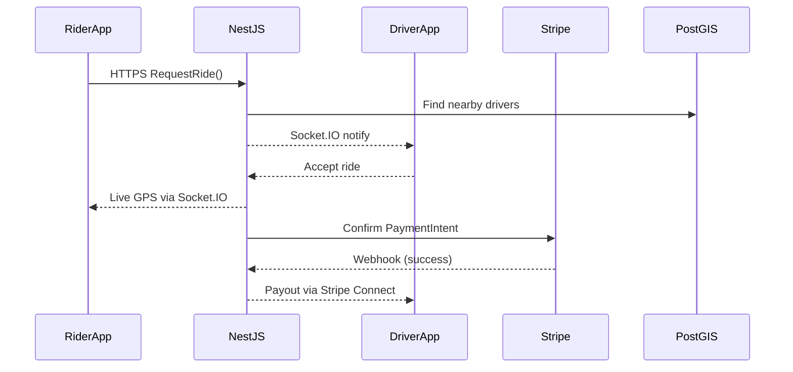

# Ride‑Hailing Platform ‑ High‑Level Architecture & Use‑Case Catalogue

---

## 1. Mobile Apps

**Android UI:** Jetpack Compose (Kotlin)  
**iOS UI:** SwiftUI (Swift)  
**Shared Business Logic:** Kotlin Multiplatform Mobile (KMM) or a shared Kotlin library for data models, networking, and validation  

**Maps & Geolocation**

* Google Maps SDK (Android) / MapKit (iOS)  
* Geofencing & background location via **AndroidX Location** + **CoreLocation**

---

## 2. Real‑Time Updates

* **Protocol:** WebSockets  
* **Library:** Socket.IO (client & server)

```
Driver app streams GPS  ➔  NestJS
NestJS broadcasts nearby drivers  ➔  rider apps
```

---

## 3. Backend API & Business Logic

* **Runtime & Framework:** Node.js + NestJS (TypeScript)  
* **API Style:** REST (NestJS Controllers) + optional GraphQL (Apollo)

**Modules**

| Domain | Key Responsibilities |
|--------|----------------------|
| Auth & Security | JWT + Passport.js or OAuth2 with Auth0/Keycloak |
| Rides | Ride‑request flows, surge pricing, cancellation rules |
| Users | Profiles, ratings, KYC for drivers |
| Notifications | Integrate FCM / APNs for push |

---

## 4. Payments

* **Processor:** Stripe  

**Flow**

1. Rider enters card via **Stripe Mobile SDK**.  
2. NestJS backend captures **PaymentIntent** & handles webhooks for successful charges.  
3. Driver payouts via **Stripe Connect**.

---

## 5. Admin Dashboard & Web Portal

* **Framework:** Next.js (React + TypeScript)  

**Features**

* Server‑Side Rendering for faster load & SEO  
* NextAuth or Auth0 integration  
* API routes for quick reports (rides per hour, earnings)  
* Realtime metrics via WebSocket or polling  

---

## 6. Data Storage & Caching

| Purpose           | Technology                            |
|-------------------|---------------------------------------|
| Primary Database  | **PostgreSQL** + **PostGIS** (geospatial queries) |
| Cache / Fast Reads| **Redis** (location lookups, rate‑limiting) |
| Message Queue     | **RabbitMQ** or **Kafka** (async tasks e.g., receipts, emails) |

---

## 7. Infrastructure & DevOps

* **Containerization:** Docker  
* **Orchestration:** Kubernetes (EKS/GKE/AKS) or Docker Compose for MVP  
* **CI/CD:** GitHub Actions or GitLab CI  
* **Cloud Provider:** AWS / GCP / Azure  

**Monitoring & Logging**

* Prometheus + Grafana (metrics)  
* ELK Stack or Datadog (application logs)  

---

## 8. Security & Compliance

* **Transport:** TLS everywhere  
* **Data‑at‑Rest:** AES‑256 encryption for sensitive fields (driver documents, payment tokens)  
* **WAF / Firewall:** Cloudflare or AWS WAF  
* **Rate Limiting:** Redis‑backed token bucket  

---

## 9. How It Flows — End‑to‑End



Admins log into the **Next.js** dashboard to view live map overlays, logs, and earnings.

---

# Detailed Use‑Case Catalogue

> Click to expand individual sections.

<details>
<summary><strong>A. Passenger (Rider) Use Cases (16)</strong></summary>

| ID | Title |
|----|-------------------------------------------|
| A.1 | Register / Sign Up |
| A.2 | Login / Authenticate |
| A.3 | Forgot / Reset Password |
| A.4 | Edit Profile & Preferences |
| A.5 | Request a Ride |
| A.6 | Wait for Driver (Ads + Progress Bar) |
| A.7 | Track Driver & Trip Status |
| A.8 | Cancel Ride |
| A.9 | Rate & Review Driver |
| A.10 | View Ride History |
| A.11 | Safety Centre (SOS & Share Trip) |
| A.12 | In‑App Support Chat (Rider) |
| A.13 | Manage Favourite Locations |
| A.14 | Modify Destination Before Pickup |
| A.15 | Share Live Trip Link |
| A.16 | Manage Notification Preferences |

</details>

<details>
<summary><strong>B. Driver Use Cases (13)</strong></summary>

| ID | Title |
|----|-----------------------------------|
| B.1 | Driver Onboarding & Vehicle Setup |
| B.2 | Go Online / Offline |
| B.3 | Accept / Decline Ride |
| B.4 | Navigate to Pickup & Start Trip |
| B.5 | Complete Trip & End Ride |
| B.6 | Earnings Dashboard (Distance‑Only) |
| B.7 | View Ride History & Filters |
| B.8 | Profile & Document Management |
| B.9 | In‑App Support Chat (Driver) |
| B.10 | Change Password / MFA Recovery |
| B.11 | Safety Incident Reporting |
| B.12 | Rate & Review Rider |
| B.13 | Export Distance Log (CSV) |

</details>

<details>
<summary><strong>C. Admin / Back‑Office Use Cases (21)</strong></summary>

| ID | Title |
|----|-----------------------------------------------------|
| C.1 | Approve / Reject Driver Applications |
| C.2 | Show / Hide Driver Details to Clients |
| C.3 | Assign Driver Manually / Forward to Fleet |
| C.4 | Configure Pricing Parameters (base + per‑km + per‑minute) |
| C.5 | Enable / Disable Auto‑Assignment |
| C.6 | Resolve Disputes & Support Tickets |
| C.7 | Promotion & Campaign Management |
| C.8 | Block‑List Management |
| C.9 | Spam Filtering & Content Moderation |
| C.10 | Enhanced Support & Ticket Workflows |
| C.11 | CRUD Admin Accounts & Roles |
| C.12 | Content Management (Blog / FAQ / Banners) |
| C.13 | Analytics & Reports |
| C.14 | System Settings & Security |
| C.15 | Suspend / Reinstate Driver |
| C.16 | GDPR Data‑Erasure Workflow |
| C.17 | Audit Log & Access Review |
| C.18 | Configure Retention Windows |
| C.19 | System Health & Alerting |
| C.20 | Role & Permission Templates |
| C.21 | Generate & Schedule Reports |

</details>

<details>
<summary><strong>D. Public Website / PWA Use Cases (4)</strong></summary>

| ID | Title |
|----|----------------------------|
| D.1 | Browse Marketing Content |
| D.2 | Web‑Booking Widget |
| D.3 | Install PWA & Receive Push |
| D.4 | Handle 404 & Offline States |

</details>

<details>
<summary><strong>E. Driver Portal (Web) Use Cases (8)</strong></summary>

| ID | Title |
|----|----------------------------------|
| E.1 | Login & MFA |
| E.2 | Profile & Document Management |
| E.3 | Availability Scheduling |
| E.4 | View Ride History & Filters |
| E.5 | Earnings Dashboard |
| E.6 | Support Centre |
| E.7 | Two‑Factor Recovery |
| E.8 | Download & Print Documents |

</details>

<details>
<summary><strong>F. Cross‑Cutting / System‑Wide Use Cases (3)</strong></summary>

| ID | Title |
|----|-----------------------------------------------------------|
| F.1 | Localization / Language Switch |
| F.2 | Accessibility Settings (contrast, font, screen‑reader) |
| F.3 | Notifications Center (view & dismiss past pushes) |

</details>

---

# Suggested Component‑Level Diagram Modules

Below is a concise list of logical modules that often appear in component diagrams for large‑scale ride‑hailing systems. Each module can map to one or more microservices depending on deployment strategy.

<details>
<summary><strong>Component Diagram Modules</strong></summary>

1. **Mobile Apps ↔ API Gateway** — Passenger & Driver apps, API‑Gateway façade, rate‑limiting, JWT injection  
2. **Authentication & Identity** — Auth service, MFA, password reset, social‑login adapters  
3. **User Profile & Preferences** — Profile service, favorites, notification settings, GDPR store  
4. **Ride Request & Matching** — Ride service, matching engine, surge calculator, ETA/maps adapter  
5. **Driver Dispatch & Navigation** — Driver status service, route‑planner, telemetry collector  
6. **Trip Lifecycle Management** — State‑machine, odometer tracker, cancellation handler  
7. **Payment, Pricing & Payouts** — Fare calculator, promo/discount engine, payment gateway, driver wallet  
8. **Rating & Feedback** — Rating service, sentiment filter, reputation scorer  
9. **Notification Delivery** — Push gateway, SMS/email adapters, templating service  
10. **Support & Ticketing** — Ticket service, chatbot, agent console, SLA timer  
11. **Admin / Back‑Office Portal** — RBAC layer, driver‑approval workflow, content CMS  
12. **Analytics & Reporting** — Event sink, OLAP store, dashboard renderer, export scheduler  
13. **Audit & Compliance** — Audit log, access‑review tool, GDPR erasure workflow  
14. **Configuration & Pricing Management** — Feature‑flag service, pricing rule store, dynamic config API  
15. **Promotion & Campaign Manager** — Voucher generator, segmentation engine, campaign scheduler  
16. **Maps & Geolocation Services** — Map tile proxy, geocoder, distance‑matrix cache  
17. **Event Bus & Streaming** — Kafka/NATS cluster, schema registry, DLQ & retry orchestrator  
18. **Monitoring & Alerting** — Metrics collector, log shipper, APM, on‑call PagerDuty  
19. **System Health & Self‑Healing** — Circuit‑breaker, auto‑scaler, chaos injector  
20. **Developer / Partner API** — OAuth2 server, rate‑limiter, API documentation portal  

</details>

---

## License

Released under the MIT License. Feel free to adapt for your own projects.
