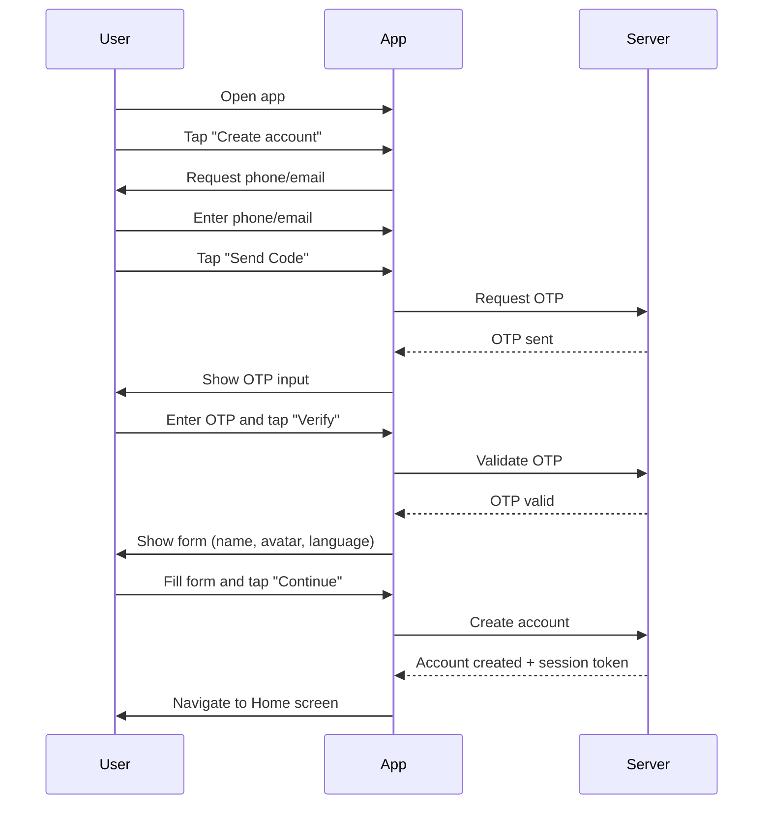

# A.1 – Register / Sign Up <MVP>

## Core Scenario

**Primary actor:** New Rider

**Trigger event:** User opens the app and chooses to create a new account

**Pre-conditions:**

* The app is installed
* Rider has not registered before

## Main Success Flow

**Step one:** User opens app → taps "Create account"

**Step two:** System asks for phone/email → user enters → taps "Send Code"

**Step three:** System sends OTP → user types it → taps "Verify"

**Step four:** System shows short form (name, avatar, language) → user completes → taps "Continue"

**Step five:** System creates account, issues session token, navigates to Home screen

**Post-conditions:**

* New user account is created
* Session is active
* User is on the Home screen

## Standard Alternate / Error Paths

**A-1**

* Condition / Branch: Invalid phone/email format
* Expected behaviour: System shows validation error and highlights the incorrect field

**A-2**

* Condition / Branch: Wrong or expired OTP
* Expected behaviour: System displays "Code incorrect—resend?" with option to resend OTP

**A-3**

* Condition / Branch: User cancels during any step
* Expected behaviour: Registration process is aborted, no account is created

## Edge & Stretch Scenarios

**E-1**

* Category: Connectivity
* Scenario: Device goes offline during OTP verification
* Release tag: Stretch

**E-2**

* Category: Permissions
* Scenario: User denies location on first launch
* Release tag: Stretch

**E-3**

* Category: Accessibility
* Scenario: User switches to high-contrast mode mid-registration
* Release tag: Stretch

**E-4**

* Category: Performance
* Scenario: Large payload (e.g., avatars) arrives during profile form sync
* Release tag: Stretch

## Acceptance Criteria (G/W/T)

**Given** the app is installed and the user has not registered before
**When** the user opens the app and completes the sign-up flow
**Then** a new account should be created, and the user is directed to the Home screen with an active session

---

## Mermaid Sequence Diagram

