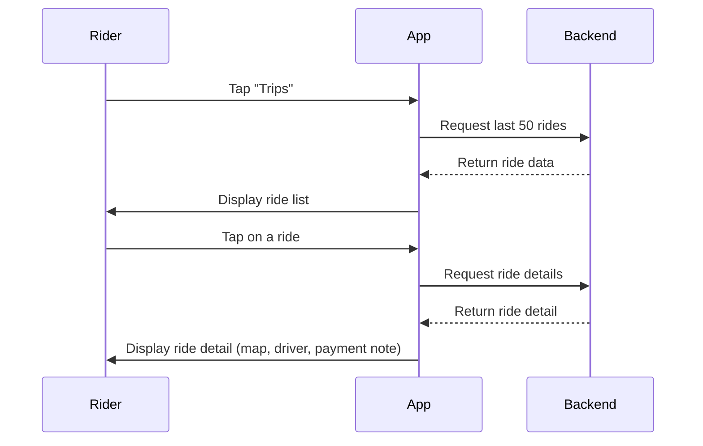

## A.10 – View Ride History <MVP>

### Core Scenario

**Primary actor**
– Rider

**Trigger event**
– Rider opens the menu and selects "Trips"

**Pre-conditions**
– Rider is logged in

### Main success flow

**Step one**
– Rider opens Menu › Trips

**Step two**
– System loads last 50 rides and displays each with date, route, fare note "Pay driver"

**Step three**
– Rider taps a ride, and the system shows ride details (map trace, driver info, offline payment note)

### Post-conditions

– Rider views historical ride details

### Standard Alternate / Error Paths

**A-1**
– Condition / Branch: No rides yet
– Expected behaviour: System displays empty-state illustration with message: "Your trips will appear here."

**A-2**
– Condition / Branch: Ride detail retrieval error
– Expected behaviour: System shows error toast and returns user to trip list

### Edge & Stretch Scenarios

**E-1**
– Category: Connectivity
– Scenario: Device goes offline during ride list or detail load
– Release tag: Stretch

**E-2**
– Category: Permissions
– Scenario: User denies location on first launch
– Release tag: Stretch

**E-3**
– Category: Accessibility
– Scenario: Switch to high-contrast mid-ride
– Release tag: Stretch

**E-4**
– Category: Performance
– Scenario: Large payload arrives during sync
– Release tag: Stretch

### Acceptance-Criteria Stencil (G/W/T)

**Given** the rider is logged in and on the main menu
**When** they tap on "Trips"
**Then** they should see a list of up to 50 past rides with key details or an empty state message if none exist

### Mermaid Sequence Diagram

