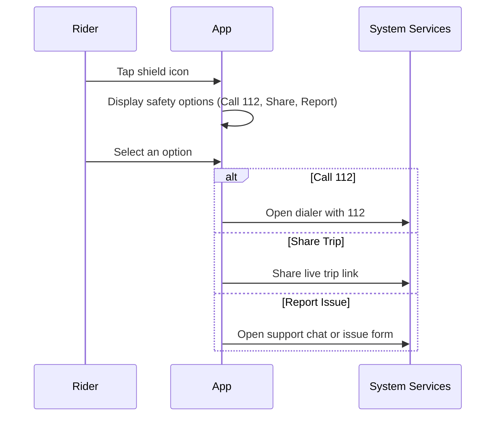

# A.11 – Safety Centre (SOS & Share Trip) <MVP>

## Core Scenario

**Primary actor**: Rider  
**Trigger event**: Rider taps the shield icon from a live tracking screen  
**Pre-conditions**:  
- User is on a live tracking screen (e.g., tracking driver or en route)  
- User is logged in

## Main Success Flow

1. Rider taps shield icon  
2. System displays options: Call 112, Share live trip, Report safety issue  
3. User selects an action → system performs it (e.g., opens dialer, shares link, opens chat)

## Post-conditions

- Safety action is initiated successfully
- User remains on the live tracking screen

## Standard Alternate / Error Paths

**A-1**  
- Condition / Branch: Permission denied to phone or SMS  
- Expected behaviour: System requests permission or displays appropriate error message

**A-2**  
- Condition / Branch: User dismisses safety menu  
- Expected behaviour: System closes dialog and returns to tracking screen

## Edge & Stretch Scenarios

**E-1**  
- Category: Connectivity  
- Scenario: Device goes offline during sharing  
- Release tag: Stretch  

**E-2**  
- Category: Permissions  
- Scenario: User denies phone/SMS/location permissions  
- Release tag: Stretch  

**E-3**  
- Category: Accessibility  
- Scenario: Switch to high-contrast mid-ride  
- Release tag: Stretch  

**E-4**  
- Category: Performance  
- Scenario: Large payload arrives during sync  
- Release tag: Stretch  

## Acceptance-Criteria Stencil (G/W/T)

**Given** user is on the live tracking screen  
**When** they tap the shield icon and choose a safety option  
**Then** the system must perform the selected action or display an error if blocked by permissions

## Mermaid Sequence Diagram

