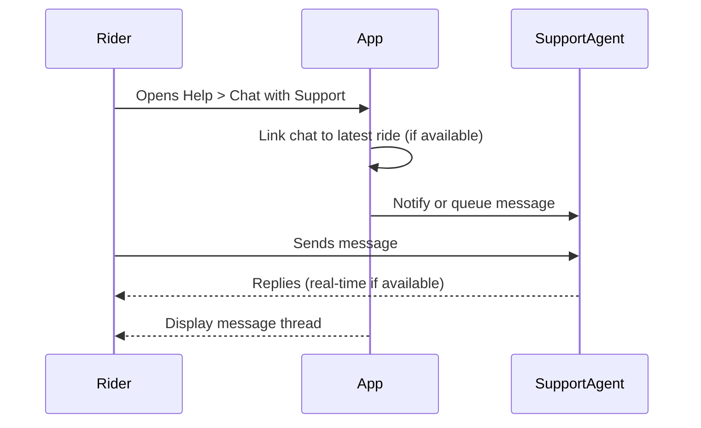

# A.12 – In-App Support Chat (Rider) <MVP>

## Core Scenario

### Primary actor
Rider

### Trigger event
User opens Help > Chat with Support

### Pre-conditions
- User is logged in

### Main success flow
1. Rider opens Help › Chat with Support  
2. System creates or joins chat room linked to latest ride  
3. Rider sends message → agent replies; messages stream in real time  

### Post-conditions
- Conversation thread is saved and accessible for future reference

## Standard Alternate / Error Paths

### A-1
- Condition / Branch: No agent available  
- Expected behaviour: System shows “We’ll reply by email” and takes message

### A-2
- Condition / Branch: Rider has no recent ride  
- Expected behaviour: Chat opens in general support queue

## Edge & Stretch Scenarios

### E-1
- Category: Connectivity  
- Scenario: Device goes offline during chat  
- Release tag: Stretch  

### E-2
- Category: Permissions  
- Scenario: User denies location on first launch  
- Release tag: Stretch  

### E-3
- Category: Accessibility  
- Scenario: Switch to high-contrast mid-ride  
- Release tag: Stretch  

### E-4
- Category: Performance  
- Scenario: Large payload arrives during sync  
- Release tag: Stretch  

## Acceptance-Criteria Stencil (G/W/T)
Given user is logged in  
When rider opens Help > Chat with Support and sends a message  
Then a support agent receives the message in real-time or system queues it if unavailable  

## Mermaid Sequence Diagram

