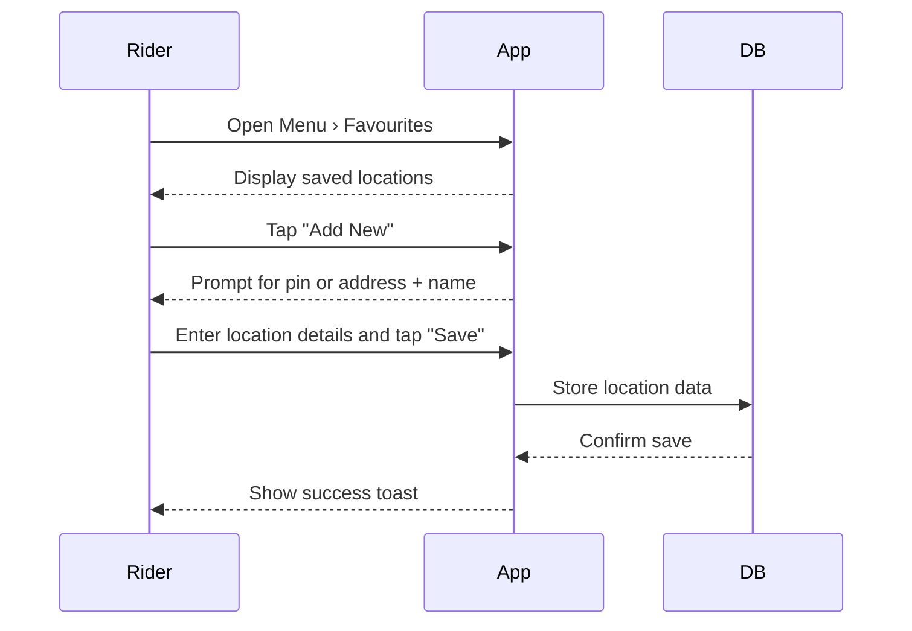

### A.13 – Manage Favourite Locations <MVP>

---

#### Core Scenario

**Primary Actor:** Rider
**Trigger Event:** Rider selects "Favourites" from the main menu

**Pre-conditions:**

* Rider is logged in

---

#### Main Success Flow

**Step One:** Rider opens *Menu › Favourites*
**Step Two:** System displays a list of saved places; Rider taps "Add New"
**Step Three:** Rider drops pin or searches for address, names location (e.g., "Home"), taps "Save"
**Step Four:** System saves location; it now appears in pickup/destination suggestions

---

**Post-conditions:**

* Location is saved and available in location suggestions for future rides

---

#### Standard Alternate / Error Paths

**A-1**
*Condition / Branch:* Rider swipes left on a saved place
*Expected Behaviour:* System prompts "Delete?" and removes entry if confirmed

**A-2**
*Condition / Branch:* No internet connectivity while saving
*Expected Behaviour:* System shows "Could not save—check connection" toast and retries on reconnection

---

#### Edge & Stretch Scenarios

**E-1**
*Category:* Connectivity
*Scenario:* Device goes offline during place search or save
*Release tag:* Stretch

**E-2**
*Category:* Permissions
*Scenario:* User denies location access when dropping pin
*Release tag:* Stretch

**E-3**
*Category:* Accessibility
*Scenario:* Screen reader active, all location names read out loud
*Release tag:* Stretch

**E-4**
*Category:* Performance
*Scenario:* Massive list of saved locations causes scroll lag
*Release tag:* Stretch

---

#### Acceptance-Criteria Stencil (G/W/T)

**Given** Rider is logged in and on Favourites screen
**When** Rider adds a new location and taps Save
**Then** The location is saved and appears in suggestions

---

