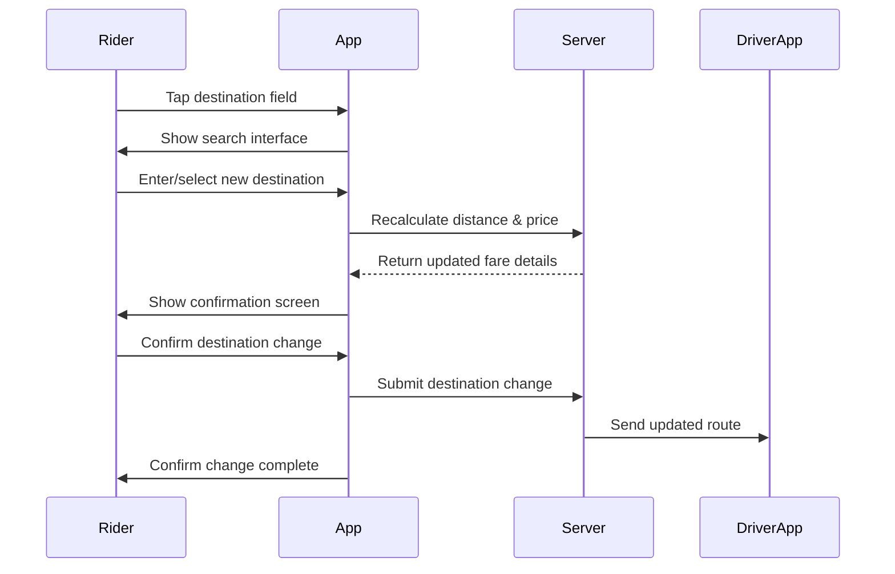

# A.14 – Modify Destination Before Pickup <MVP>

## Core Scenario

**Primary actor**: Rider  
**Trigger event**: Rider taps on current destination field  
**Pre-conditions**:
- Ride status = Driver En Route
- Driver has not tapped “Start Ride”

## Main Success Flow

**Step one**: Rider taps current destination field  
**Step two**: System allows new search; user selects new drop-off  
**Step three**: System recalculates distance & updates price note → shows confirmation  
**Step four**: Rider confirms → system updates ride; driver app receives new route  

## Post-conditions
- Ride details updated with new destination
- Driver receives updated route

## Standard Alternate / Error Paths

**A-1**  
- Condition / Branch: Attempt after ride started  
- Expected behaviour: System shows “Destination locked—ask driver.”

**A-2**  
- Condition / Branch: New destination out of zone  
- Expected behaviour: System rejects change

## Edge & Stretch Scenarios

**E-1**  
- Category: Connectivity  
- Scenario: Device goes offline during destination change  
- Release tag: Stretch

**E-2**  
- Category: Permissions  
- Scenario: User denies location on first launch  
- Release tag: Stretch

**E-3**  
- Category: Accessibility  
- Scenario: Switch to high-contrast mid-ride  
- Release tag: Stretch

**E-4**  
- Category: Performance  
- Scenario: Large payload arrives during sync  
- Release tag: Stretch

## Acceptance Criteria

**Given** ride status is "Driver En Route" and ride not started  
**When** rider changes the destination before pickup  
**Then** system should recalculate fare, confirm change, and update both rider and driver views

## Mermaid Sequence Diagram

