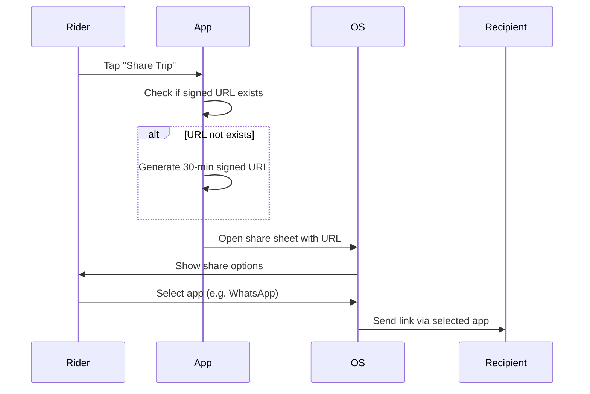

# A.15 Share Live Trip Link (MVP)

## Core Scenario

### Use-Case Title

A.15 Share Live Trip Link

### Primary Actor

Rider

### Trigger Event

Rider initiates action by tapping "Share Trip" button

### Pre-conditions

* A ride must be in progress OR the driver must be en-route

### Main Success Flow

**Step One:** Rider taps "Share Trip"

**Step Two:** System checks if a signed URL already exists

* If not, generates a signed URL valid for 30 minutes

**Step Three:** System opens the OS-native share sheet with the URL pre-populated

**Step Four:** Rider selects desired app (e.g., WhatsApp, SMS) to send the link

### Post-conditions

* Recipient receives a valid tracking link for the rider's current trip

## Standard Alternate / Error Paths

### A-1

**Condition / Branch:** Link already generated
**Expected Behaviour:** System offers option to "Copy again" or "Reshare"

### A-2

**Condition / Branch:** Share sheet fails to open due to system-level error
**Expected Behaviour:** Fallback to copying the link to clipboard with confirmation toast

## Edge & Stretch Scenarios

### E-1

**Category:** Connectivity
**Scenario:** Device goes offline during link generation
**Release tag:** Stretch
**Expected Behaviour:** System shows retry option or error toast

### E-2

**Category:** Permissions
**Scenario:** User denies location permission on first launch
**Release tag:** Stretch
**Expected Behaviour:** System explains why location is needed with a prompt to enable it

### E-3

**Category:** Accessibility
**Scenario:** User switches to high-contrast mode mid-ride
**Release tag:** Stretch
**Expected Behaviour:** UI adapts accordingly with no disruption to functionality

### E-4

**Category:** Performance
**Scenario:** Large payload (e.g., background sync or update) arrives during link generation
**Release tag:** Stretch
**Expected Behaviour:** System prioritizes trip sharing and defers background sync

## Acceptance Criteria (G/W/T)

**Given** a ride is in progress or the driver is en route
**When** the rider taps "Share Trip"
**Then** a 30-minute signed URL is generated (if not already), and the share sheet is opened

**Given** a link is already generated
**When** the rider taps "Share Trip" again
**Then** the system presents an option to "Copy again" or re-share the link

**Given** share sheet fails to open
**When** the rider taps "Share Trip"
**Then** the system copies the link to clipboard and shows confirmation

---

## Mermaid Sequence Diagram

