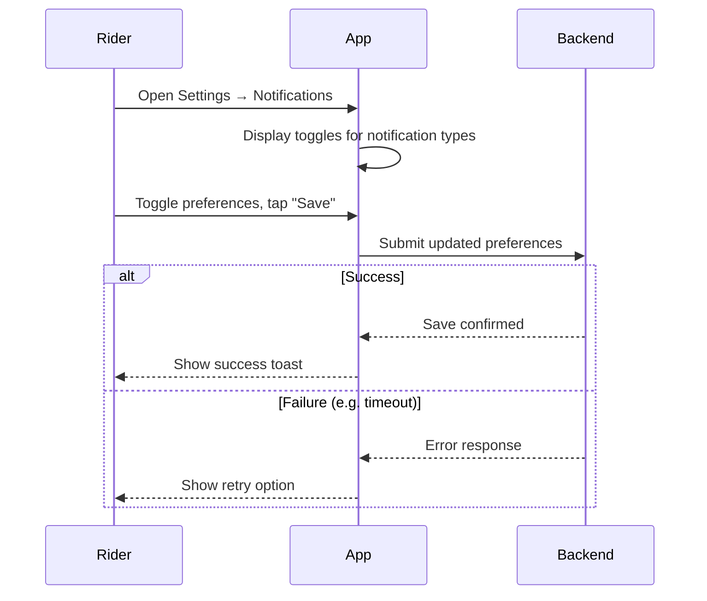

# A.16 Manage Notification Preferences (MVP)

## Core Scenario

### Use-Case Title

A.16 Manage Notification Preferences

### Primary Actor

Rider

### Trigger Event

User opens Notification settings from the app

### Pre-conditions

* User must be logged into their account

### Main Success Flow

**Step One:** Rider navigates to Settings → Notifications

**Step Two:** System displays toggles for each notification type (Ride Updates, Promotions, Safety Alerts) across Push / SMS / Email

**Step Three:** Rider adjusts preferences and taps "Save"

**Step Four:** System stores updated preferences

**Step Five:** Notification service respects saved preferences for future sends

### Post-conditions

* User’s notification settings are updated and applied in subsequent sends

## Standard Alternate / Error Paths

### A-1

**Condition / Branch:** User disables all push notifications
**Expected Behaviour:** System warns "You may miss live ride updates."

### A-2

**Condition / Branch:** Save fails due to temporary issue (e.g. backend timeout)
**Expected Behaviour:** System shows retry option or error toast

## Edge & Stretch Scenarios

### E-1

**Category:** Connectivity
**Scenario:** Device goes offline before preferences are saved
**Release tag:** Stretch
**Expected Behaviour:** System queues change locally or shows error and retry option

### E-2

**Category:** Permissions
**Scenario:** User denied system push notification permissions
**Release tag:** Stretch
**Expected Behaviour:** App informs user and provides link to OS settings

### E-3

**Category:** Accessibility
**Scenario:** User switches to high-contrast mode while in Settings
**Release tag:** Stretch
**Expected Behaviour:** UI adapts accordingly without functionality disruption

### E-4

**Category:** Performance
**Scenario:** System under high load during save operation
**Release tag:** Stretch
**Expected Behaviour:** Operation retries with backoff or saves locally until synced

## Acceptance Criteria (G/W/T)

**Given** the user is logged in and has accessed notification settings
**When** they toggle preferences and tap "Save"
**Then** the system stores the new settings and applies them for future notifications

**Given** the user disables all push notifications
**When** they attempt to save
**Then** the system warns that they may miss live ride updates

**Given** the preferences fail to save due to connectivity
**When** the rider taps "Save"
**Then** the system offers to retry or shows a clear error message

---

## Mermaid Sequence Diagram

