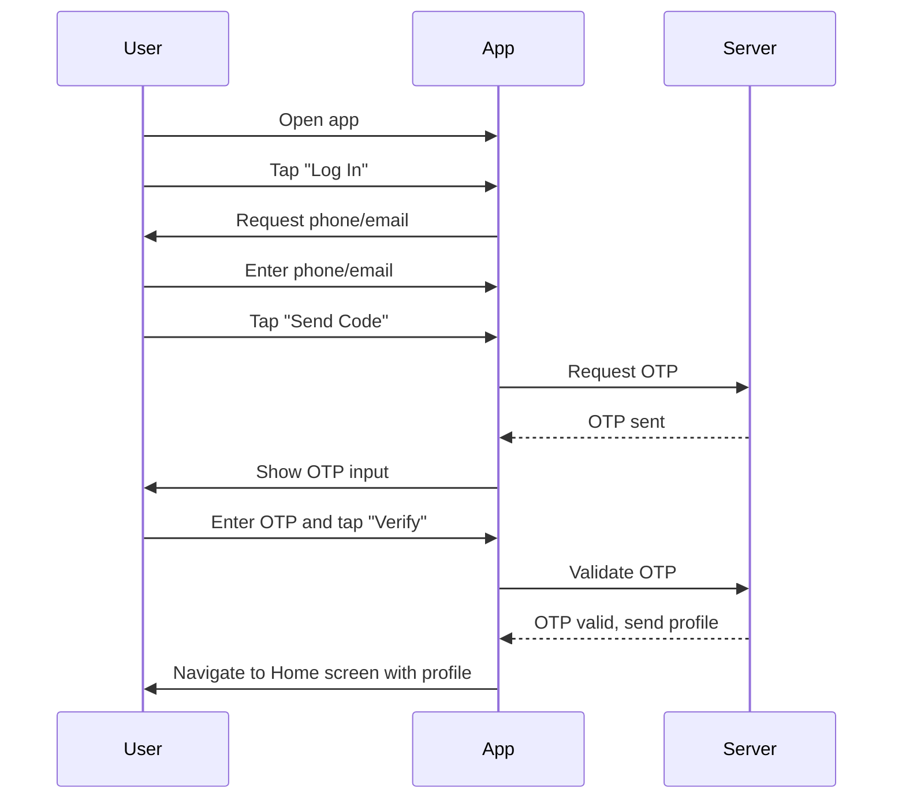

# A.2 – Login / Authenticate <MVP>

## Core Scenario

**Primary actor:** Returning Rider

**Trigger event:** User opens app and chooses to log into an existing account

**Pre-conditions:**

* Rider already has an account
* Rider is not currently signed in on the device

## Main Success Flow

**Step one:** User taps "Log In"

**Step two:** System shows phone/email input → user enters → taps "Send Code"

**Step three:** System sends OTP → user types it → taps "Verify"

**Step four:** System validates OTP token, loads rider profile, navigates to Home screen

**Post-conditions:**

* Session is active
* User is on the Home screen with loaded profile

## Standard Alternate / Error Paths

**A-1**

* Condition / Branch: Wrong OTP entered
* Expected behaviour: System displays an error and allows the user to retry or resend OTP

**A-2**

* Condition / Branch: User cancels login midway
* Expected behaviour: Login process is aborted, no session is created

## Edge & Stretch Scenarios

**E-1**

* Category: Connectivity
* Scenario: Device goes offline during OTP validation
* Release tag: Stretch

**E-2**

* Category: Permissions
* Scenario: User denies location on first launch
* Release tag: Stretch

**E-3**

* Category: Accessibility
* Scenario: User switches to high-contrast mode mid-login
* Release tag: Stretch

**E-4**

* Category: Performance
* Scenario: Large payload (e.g., rider profile) received during session startup
* Release tag: Stretch

## Acceptance Criteria (G/W/T)

**Given** a user account exists and the user is not signed in
**When** the user opens the app and completes the login flow
**Then** the system logs them in, loads their profile, and navigates to the Home screen

---

## Mermaid Sequence Diagram

