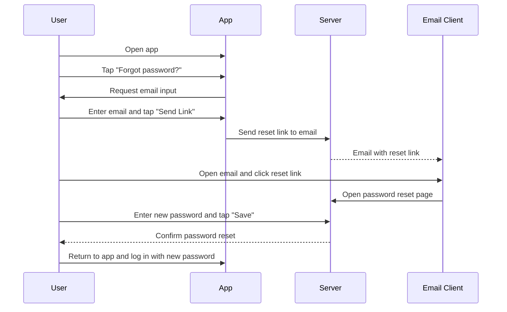

# A.3 – Forgot / Reset Password <MVP>

## Core Scenario

**Primary actor:** Rider

**Trigger event:** User on login screen selects “Forgot password?”

**Pre-conditions:**

* Rider account uses email/password login
* Rider cannot recall password

## Main Success Flow

**Step one:** User taps “Forgot password?” on login screen

**Step two:** System asks for email → user enters → taps “Send Link”

**Step three:** System emails reset link → user opens link → sets new password → taps “Save”

**Step four:** System confirms reset; user returns to app and logs in with new password

**Post-conditions:**

* Rider’s password is updated
* Rider can now log in with the new password

## Standard Alternate / Error Paths

**A-1**

* Condition / Branch: Email not found in system
* Expected behaviour: System displays “No account with this email” error

**A-2**

* Condition / Branch: User does not complete password reset via link
* Expected behaviour: Password remains unchanged; system prompts to restart process

## Edge & Stretch Scenarios

**E-1**

* Category: Connectivity
* Scenario: Device goes offline during password reset request
* Release tag: Stretch

**E-2**

* Category: Permissions
* Scenario: User denies location on first launch
* Release tag: Stretch

**E-3**

* Category: Accessibility
* Scenario: User switches to high-contrast mode during reset flow
* Release tag: Stretch

**E-4**

* Category: Performance
* Scenario: Password reset link opens slowly due to server load
* Release tag: Stretch

## Acceptance Criteria (G/W/T)

**Given** a registered rider using email/password login who has forgotten their password
**When** the user completes the password reset process via email link
**Then** they should be able to successfully log in with the new password

---

## Mermaid Sequence Diagram

