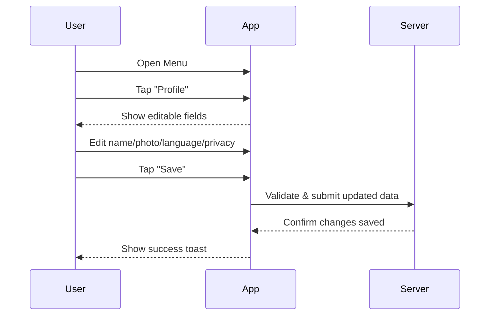

# A.4 – Edit Profile & Preferences <MVP>

## Core Scenario

**Primary actor:** Authenticated Rider

**Trigger event:** User opens the Menu and navigates to Profile

**Pre-conditions:**

* User is logged in

## Main Success Flow

**Step one:** User opens Menu → taps "Profile"

**Step two:** System displays editable fields (name, photo, language, privacy)

**Step three:** User updates one or more values and taps "Save"

**Step four:** System validates input, stores changes, and displays a confirmation toast

**Post-conditions:**

* User profile and preferences are updated and stored

## Standard Alternate / Error Paths

**A-1**

* Condition / Branch: Unsupported image format uploaded
* Expected behaviour: System prompts user to choose a different photo format

**A-2**

* Condition / Branch: Network error during save
* Expected behaviour: System displays “Couldn’t save—try again” message and allows retry

## Edge & Stretch Scenarios

**E-1**

* Category: Connectivity
* Scenario: Device goes offline during profile update
* Release tag: Stretch

**E-2**

* Category: Permissions
* Scenario: User denies location on first launch
* Release tag: Stretch

**E-3**

* Category: Accessibility
* Scenario: User switches to high-contrast mode mid-profile edit
* Release tag: Stretch

**E-4**

* Category: Performance
* Scenario: Large avatar image delays UI feedback
* Release tag: Stretch

## Acceptance Criteria (G/W/T)

**Given** a user is logged in and viewing their profile
**When** they edit and save changes to their information
**Then** the system should validate and persist the updates, confirming with a success toast

---

## Mermaid Sequence Diagram

