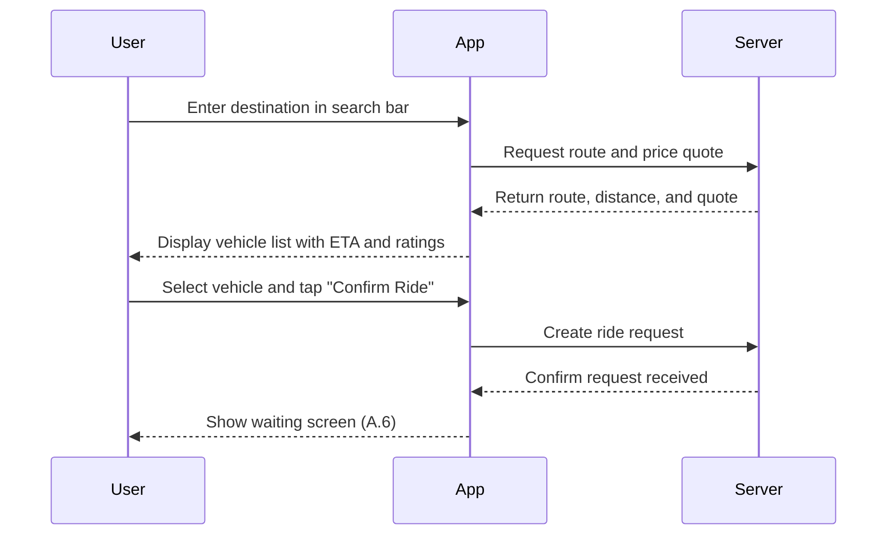

# A.5 – Request a Ride <MVP>

## Core Scenario

**Primary actor:** Rider

**Trigger event:** User opens the app, sees map, and enters a destination to book a ride

**Pre-conditions:**

* Location permission is granted
* User is on the Home/Map screen

## Main Success Flow

**Step one:** User enters destination in search bar

**Step two:** System draws route and calculates distance; fetches a price quote based on distance

**Step three:** System displays list of vehicle types (e.g., Sedan, XL) with ETA and average driver rating

**Step four:** User selects a vehicle type and taps “Confirm Ride”

**Step five:** System creates ride request and transitions to waiting screen (linked to use case A.6)

**Post-conditions:**

* A valid ride request is created and awaiting driver assignment

## Standard Alternate / Error Paths

**A-1**

* Condition / Branch: Destination outside service area
* Expected behaviour: System displays "Out of zone" message and prevents ride confirmation

**A-2**

* Condition / Branch: Price quote is older than 30 seconds
* Expected behaviour: System refreshes the quote and prompts user to reconfirm

## Edge & Stretch Scenarios

**E-1**

* Category: Connectivity
* Scenario: Device goes offline after route is drawn but before confirming ride
* Release tag: Stretch

**E-2**

* Category: Permissions
* Scenario: User denies location access on first app launch
* Release tag: Stretch

**E-3**

* Category: Accessibility
* Scenario: User switches to high-contrast mode during ride selection
* Release tag: Stretch

**E-4**

* Category: Performance
* Scenario: Large payload or slow API affects quote loading
* Release tag: Stretch

## Acceptance Criteria (G/W/T)

**Given** that location permission is granted and user is on the Home screen
**When** the user enters a valid destination and confirms a ride
**Then** the system should calculate price, display vehicle options, and successfully create a ride request

---

## Mermaid Sequence Diagram

