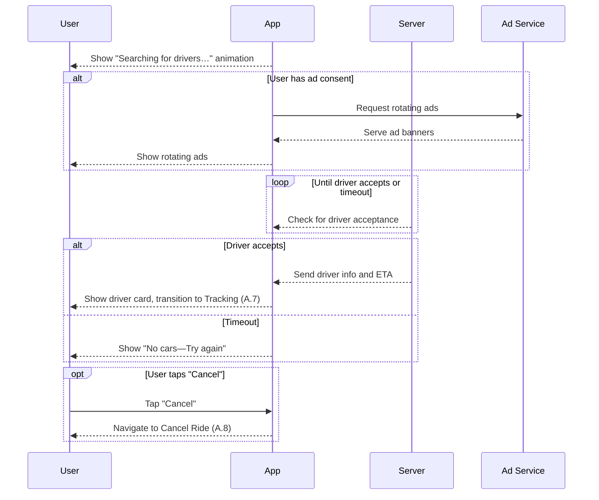

# A.6 – Wait for Driver (Ads + Progress Bar) <MVP>

## Core Scenario

**Primary actor:** Rider

**Trigger event:** Ride request is submitted and pending driver assignment

**Pre-conditions:**

* Valid ride request has been created
* No driver has accepted the request yet

## Main Success Flow

**Step one:** System displays a progress animation “Searching for nearby drivers…”

**Step two:** If user has consented to ads, ad banner rotates every N seconds

**Step three:** When a driver accepts the ride, system shows driver card and ETA, then transitions to Tracking (use case A.7)

**Post-conditions:**

* Driver is assigned to the ride, and the user is moved to tracking screen

## Standard Alternate / Error Paths

**A-1**

* Condition / Branch: No driver found after timeout period
* Expected behaviour: System displays “No cars—Try again” and allows user to reattempt or cancel

**A-2**

* Condition / Branch: Rider taps “Cancel” before assignment
* Expected behaviour: System navigates to Cancel Ride flow (A.8)

## Edge & Stretch Scenarios

**E-1**

* Category: Connectivity
* Scenario: Device goes offline during driver search
* Release tag: Stretch

**E-2**

* Category: Permissions
* Scenario: User denies location on first launch
* Release tag: Stretch

**E-3**

* Category: Accessibility
* Scenario: User switches to high-contrast mode during search
* Release tag: Stretch

**E-4**

* Category: Performance
* Scenario: Ad system loads slowly and blocks UI thread
* Release tag: Stretch

## Acceptance Criteria (G/W/T)

**Given** a ride request has been created
**When** no driver has yet accepted
**Then** the system should show progress animation, rotate ads if enabled, and move to Tracking when a driver is assigned

---

## Mermaid Sequence Diagram

