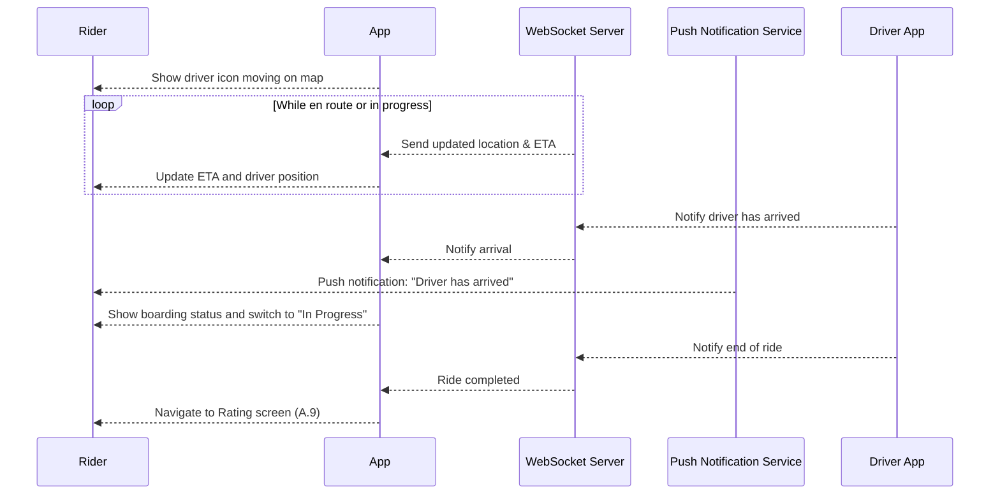

# A.7 – Track Driver & Trip Status <MVP>

## Core Scenario

**Primary actor:** Rider

**Trigger event:** Driver has accepted the ride and is en route or ride is in progress

**Pre-conditions:**

* Driver is assigned
* Ride status is either "Driver En Route" or "In Progress"

## Main Success Flow

**Step one:** Map shows real-time driver location moving toward pickup point

**Step two:** ETA updates dynamically via WebSocket; system sends push notification on driver arrival

**Step three:** Once rider is onboard, status changes to "In Progress" and ETA to destination is shown live

**Step four:** Upon driver ending ride, system transitions rider to rating screen (A.9)

**Post-conditions:**

* Rider sees accurate live tracking
* Rider is taken to rating screen upon ride completion

## Standard Alternate / Error Paths

**A-1**

* Condition / Branch: GPS signal lost
* Expected behaviour: System displays last known location and “Updating…” message

**A-2**

* Condition / Branch: Rider changes destination
* Expected behaviour: System triggers flow A.14 (Change Destination)

## Edge & Stretch Scenarios

**E-1**

* Category: Connectivity
* Scenario: Device goes offline during trip tracking
* Release tag: Stretch

**E-2**

* Category: Permissions
* Scenario: User denies location access on first launch
* Release tag: Stretch

**E-3**

* Category: Accessibility
* Scenario: User switches to high-contrast mode mid-trip
* Release tag: Stretch

**E-4**

* Category: Performance
* Scenario: WebSocket lag causes location updates to stutter
* Release tag: Stretch

## Acceptance Criteria (G/W/T)

**Given** the rider has a driver en route or ride is in progress
**When** the system receives location updates
**Then** the app should update the map and ETA accordingly, and transition to rating screen when the ride ends

---

## Mermaid Sequence Diagram

