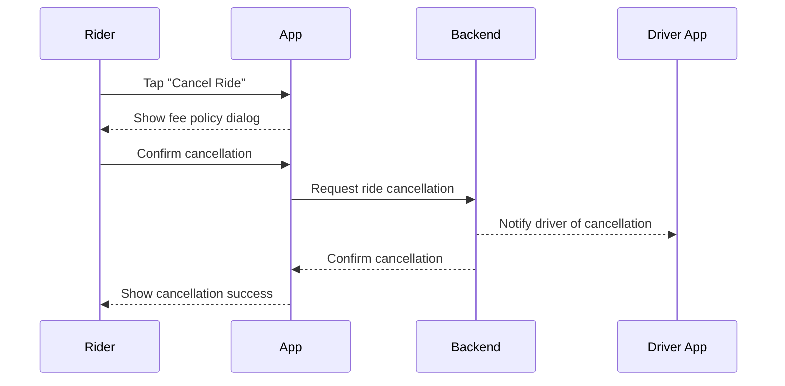

# A.8 – Cancel Ride <MVP>

## Core Scenario

**Primary actor:** Rider

**Trigger event:** Rider decides to cancel the ride before pickup

**Pre-conditions:**

* Ride status is "Driver En Route" or earlier

## Main Success Flow

**Step one:** Rider taps “Cancel Ride”

**Step two:** System displays cancellation policy (e.g. free within 2 minutes, fee applied after)

**Step three:** Rider confirms cancellation → system cancels the ride, notifies driver, and logs reason

**Post-conditions:**

* Ride is marked cancelled in backend
* Driver is notified
* Any applicable fee is recorded

## Standard Alternate / Error Paths

**A-1**

* Condition / Branch: Rider dismisses cancellation dialog
* Expected behaviour: Ride continues as normal

**A-2**

* Condition / Branch: Network error during cancellation
* Expected behaviour: System retries; if persistent, shows “Could not cancel” error

## Edge & Stretch Scenarios

**E-1**

* Category: Connectivity
* Scenario: Device goes offline during cancellation attempt
* Release tag: Stretch

**E-2**

* Category: Permissions
* Scenario: User denies location on first launch
* Release tag: Stretch

**E-3**

* Category: Accessibility
* Scenario: Switch to high-contrast mode mid-ride
* Release tag: Stretch

**E-4**

* Category: Performance
* Scenario: Large payload during sync while cancelling
* Release tag: Stretch

## Acceptance Criteria (G/W/T)

**Given** the rider is on a ride with status "Driver En Route" or earlier
**When** the rider confirms the cancellation
**Then** the system should cancel the ride, notify the driver, and show confirmation to the rider

---

## Mermaid Sequence Diagram

