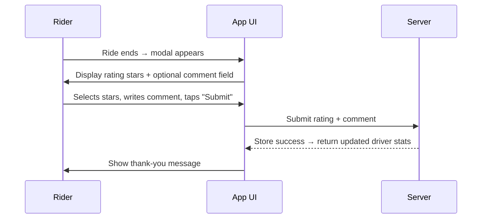

## A.9 – Rate & Review Driver <MVP>

### Core Scenario

**Primary actor**
Rider

**Trigger event**
Ride ends, triggering post-ride modal

**Pre-conditions**
• Ride has been completed
• Rider is authenticated

**Main success flow**

**Step one**
Post-ride modal appears with 1–5 star selector

**Step two**
User chooses stars and optionally writes a comment → taps "Submit"

**Step three**
System stores rating, updates driver average, and shows thank-you message

**Post-conditions**
• Rating stored
• Driver average rating updated
• Modal closed or dismissed

### Standard Alternate / Error Paths

**A-1**
– Condition / Branch: User skips rating
– Expected behaviour: System auto-dismisses rating prompt after 24 hours

**A-2**
– Condition / Branch: Network error during submission
– Expected behaviour: Retry mechanism or store locally for future sync

### Edge & Stretch Scenarios

**E-1**
– Category: Connectivity
– Scenario: Device goes offline during step 2
– Release tag: Stretch

**E-2**
– Category: Permissions
– Scenario: User denies location on first launch
– Release tag: Stretch

**E-3**
– Category: Accessibility
– Scenario: Switch to high-contrast mid-ride
– Release tag: Stretch

**E-4**
– Category: Performance
– Scenario: Large payload arrives during sync
– Release tag: Stretch

### Acceptance-Criteria Stencil (G/W/T)

**Given** the ride has been completed
**When** the user submits a rating
**Then** the system should store the rating, update the driver’s average, and show a thank-you message

### Mermaid Sequence Diagram

