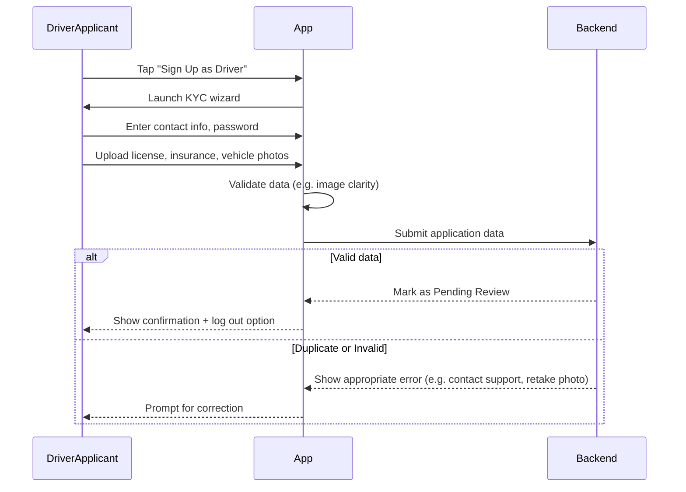

# B.1 Driver Onboarding & Vehicle Setup (MVP)

## Core Scenario

### Use-Case Title

B.1 Driver Onboarding & Vehicle Setup

### Primary Actor

Driver Applicant

### Trigger Event

User taps "Sign Up as Driver" on the login or home screen

### Pre-conditions

* The app must be installed
* There is no active driver account on the device

### Main Success Flow

**Step One:** User taps "Sign Up as Driver"

**Step Two:** System launches a KYC onboarding wizard; user enters contact information and password

**Step Three:** User uploads required documents: driver’s license, insurance papers, and vehicle photos, then taps "Submit"

**Step Four:** System runs basic validations and flags the account as "Pending Review"

**Step Five:** Confirmation screen informs user of approval timeline and gives option to log out

### Post-conditions

* A new driver application is created with status "Pending Review"
* User can log out and await notification of approval

## Standard Alternate / Error Paths

### A-1

**Condition / Branch:** Missing or blurry document image
**Expected Behaviour:** System prompts the user to retake and re-upload the document

### A-2

**Condition / Branch:** Duplicate license or document detected
**Expected Behaviour:** System displays “Existing account—contact support” and blocks submission

## Edge & Stretch Scenarios

### E-1

**Category:** Connectivity
**Scenario:** Device goes offline during document upload
**Release tag:** Stretch
**Expected Behaviour:** System queues upload for retry or informs user of network error

### E-2

**Category:** Permissions
**Scenario:** User denies camera or storage access when prompted
**Release tag:** Stretch
**Expected Behaviour:** App explains the need and links to settings to grant permission

### E-3

**Category:** Accessibility
**Scenario:** User switches to high-contrast mode during onboarding
**Release tag:** Stretch
**Expected Behaviour:** UI adapts instantly with no functional disruption

### E-4

**Category:** Performance
**Scenario:** App receives a large payload (e.g., bulk updates) during onboarding
**Release tag:** Stretch
**Expected Behaviour:** System defers non-essential operations until onboarding completes

## Acceptance Criteria (G/W/T)

**Given** the user has no existing driver account on the device and the app is installed
**When** the user completes the onboarding wizard and uploads all documents
**Then** the system creates a "Pending Review" driver account and displays a confirmation screen

**Given** a required document is blurry or unreadable
**When** the user attempts to submit the form
**Then** the system prompts them to re-upload the document

**Given** the uploaded license matches an existing account
**When** the user taps "Submit"
**Then** the system blocks submission and prompts the user to contact support

---

## Mermaid Sequence Diagram

