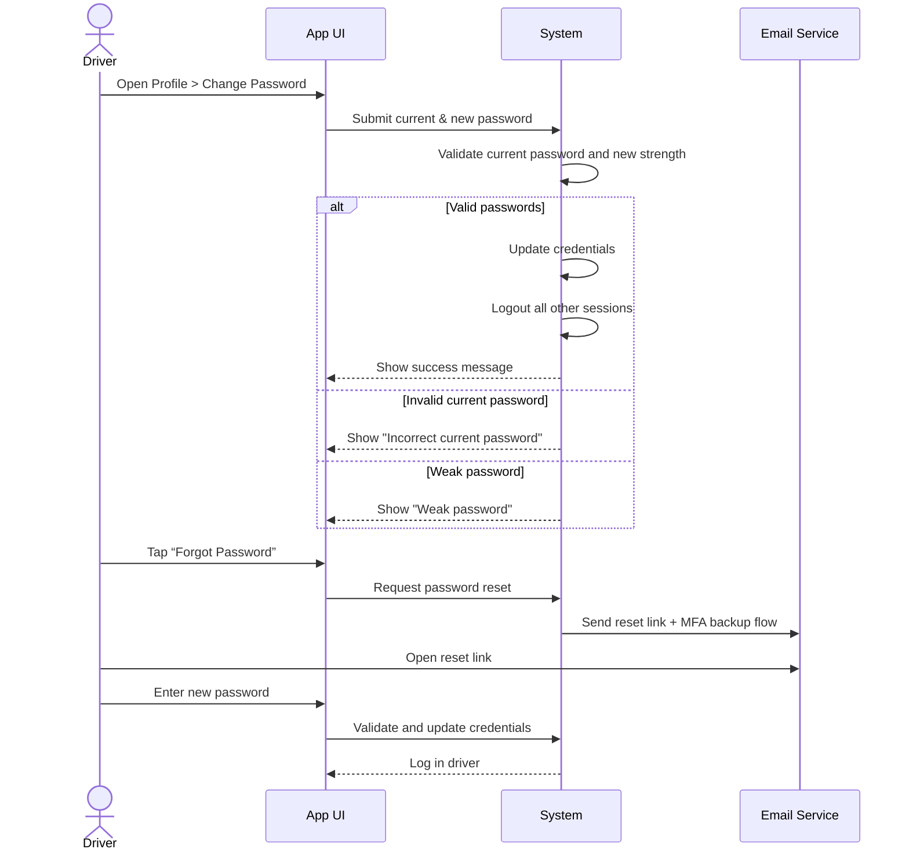

**Use-Case ID**: B.10
**Use-Case Title**: Change Password / MFA Recovery
**Release**: MVP / Phase-2

## Core Scenario

**Primary actor**: Driver
**Trigger event**: Driver initiates password change or password recovery
**Pre-conditions**:

* Driver is logged in and accessing profile settings OR has access to recovery email

**Main Success Flow (In-App Password Change)**:

1. Driver navigates to Profile > Change Password.
2. Driver enters current password and new password twice.
3. Driver taps “Save”.
4. System validates password strength and correctness of current password.
5. System updates credentials and logs out all other sessions.
6. Driver remains logged into current session.

**Post-conditions**:

* Password is successfully updated. Other sessions are logged out. MFA recovery codes updated if needed.

## Recovery Flow (Locked Out)

1. Driver taps “Forgot Password” on login screen.
2. System sends password reset link via email and initiates TOTP backup recovery flow.
3. Driver accesses the reset link and sets a new password.
4. System verifies and logs in the user with new credentials.

## Standard Alternate / Error Paths

**A-1 – Invalid current password**

* Condition: Driver enters incorrect current password
* Expected behaviour: System displays “Current password is incorrect.” and rejects submission.

**A-2 – Weak new password**

* Condition: New password does not meet complexity requirements
* Expected behaviour: System displays “Password must include upper/lowercase letters, a number, and a symbol.”

## Edge & Stretch Scenarios

**E-1 – Connectivity (Stretch)**

* Scenario: Device goes offline during step 3 or 4 (change or recovery)
* Release tag: Stretch

**E-2 – Permissions (Stretch)**

* Scenario: User denies email notification permission
* Release tag: Stretch

**E-3 – Accessibility (Stretch)**

* Scenario: Switch to high-contrast mode during password change flow
* Release tag: Stretch

**E-4 – Performance (Stretch)**

* Scenario: Backend delay in session logout after change
* Release tag: Stretch

## Acceptance Criteria (Gherkin)

```gherkin
Given Driver is logged in
When Driver enters current password and a strong new password
Then System updates the password and logs out other sessions

Given Driver is on login screen
When Driver taps “Forgot Password”
Then System sends reset link and recovery flow email

Given Driver enters wrong current password
When Driver taps “Save”
Then System displays error message and prevents password change
```

## Sequence Diagram


