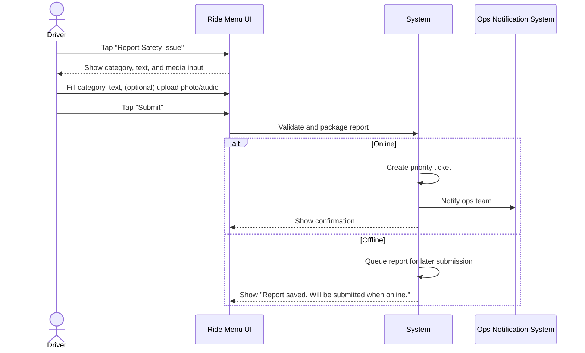

**Use-Case ID**: B.11
**Use-Case Title**: Safety Incident Reporting
**Release**: MVP / Phase-2

## Core Scenario

**Primary actor**: Driver
**Trigger event**: Driver initiates a safety report from ride menu
**Pre-conditions**:

* Driver is currently on a ride or within 2 hours of the completed ride

**Main Success Flow**:

1. Driver taps “Report Safety Issue” from the ride menu.
2. Driver selects a category (e.g., accident, harassment, etc.).
3. Driver enters a description and optionally attaches a photo or audio recording.
4. Driver taps “Submit”.
5. System creates a high-priority ticket and notifies operations.
6. System displays a confirmation message to the driver.

**Post-conditions**:

* A safety incident report is logged and routed for immediate attention.

## Standard Alternate / Error Paths

**A-1 – No connectivity**

* Condition: Device is offline during submission
* Expected behaviour: Report is queued locally and auto-submitted when connection is restored.

**A-2 – Incomplete form submission**

* Condition: Required fields (e.g., category or text) are left blank
* Expected behaviour: System blocks submission and displays validation errors.

## Edge & Stretch Scenarios

**E-1 – Connectivity (Stretch)**

* Scenario: Device loses signal during attachment upload
* Release tag: Stretch

**E-2 – Permissions (Stretch)**

* Scenario: User denies access to microphone or camera
* Release tag: Stretch

**E-3 – Accessibility (Stretch)**

* Scenario: Switch to high-contrast mode during report composition
* Release tag: Stretch

**E-4 – Performance (Stretch)**

* Scenario: Backend under load; delay in ticket creation or notification
* Release tag: Stretch

## Acceptance Criteria (Gherkin)

```gherkin
Given Driver is in or recently completed a ride
When Driver submits a safety report with category and description
Then System logs a high-priority ticket and shows confirmation

Given Driver has no connectivity
When Driver submits a safety report
Then System stores the report and sends it when back online

Given Driver omits required fields
When Driver taps “Submit”
Then System shows validation error and blocks submission
```

## Sequence Diagram


