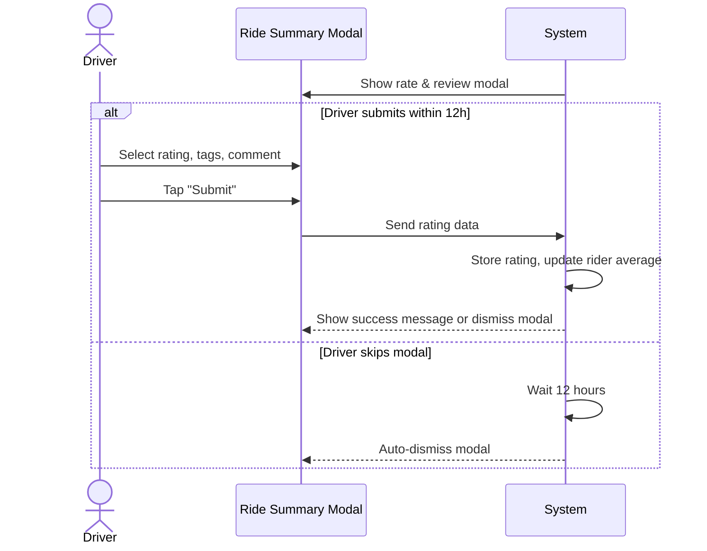

**Use-Case ID**: B.12
**Use-Case Title**: Rate & Review Rider
**Release**: MVP / Phase-2

## Core Scenario

**Primary actor**: Driver
**Trigger event**: Ride is completed and closed
**Pre-conditions**:

* A ride has been completed and closed by the system

**Main Success Flow**:

1. Modal appears prompting the driver to rate the rider (1–5 stars) and select optional tags (e.g., Polite, Late, etc.).
2. Driver selects a star rating, optional tags, and enters an optional comment.
3. Driver taps “Submit”.
4. System stores the review and updates the rider's average rating.

**Post-conditions**:

* Rider’s profile has updated rating and review stored in the system.

## Standard Alternate / Error Paths

**A-1 – Modal skipped**

* Condition: Driver does not interact with the modal within 12 hours
* Expected behaviour: System auto-dismisses the modal without submitting a review.

**A-2 – Invalid submission**

* Condition: Driver tries to submit without selecting a star rating
* Expected behaviour: System blocks submission and highlights required field.

## Edge & Stretch Scenarios

**E-1 – Connectivity (Stretch)**

* Scenario: Device goes offline during submission step
* Release tag: Stretch

**E-2 – Permissions (Stretch)**

* Scenario: User denies background refresh needed for modal timing
* Release tag: Stretch

**E-3 – Accessibility (Stretch)**

* Scenario: High-contrast mode activated during modal interaction
* Release tag: Stretch

**E-4 – Performance (Stretch)**

* Scenario: Backend delay while updating rider’s average
* Release tag: Stretch

## Acceptance Criteria (Gherkin)

```gherkin
Given a ride has just been completed
When the modal appears and the driver submits a rating
Then the system stores the rating and updates the rider’s average

Given the driver does not interact with the modal
When 12 hours pass
Then the modal auto-dismisses and no rating is submitted

Given the driver attempts to submit without a rating
When the driver taps “Submit”
Then the system blocks submission and shows validation error
```

## Sequence Diagram


