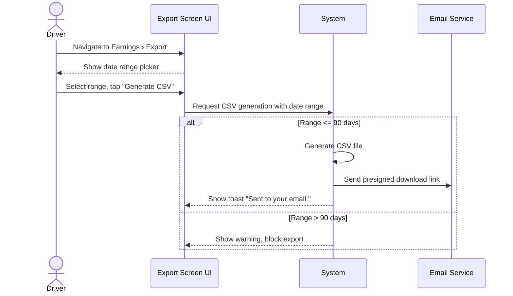

**Use-Case ID**: B.13
**Use-Case Title**: Export Distance Log (CSV)
**Release**: MVP / Phase-2

## Core Scenario

**Primary actor**: Driver
**Trigger event**: Driver initiates an export of ride distance data from the Earnings screen
**Pre-conditions**:

* Driver has completed rides within the selected date range

**Main Success Flow**:

1. Driver navigates to Earnings › Export section.
2. Driver selects a date range and taps “Generate CSV”.
3. System processes the request, generates a CSV file.
4. System sends a presigned download link via email.
5. System shows a toast message: “Sent to your email.”

**Post-conditions**:

* Driver receives an email with a downloadable CSV file containing ride distance data.

## Standard Alternate / Error Paths

**A-1 – Date range exceeds limit**

* Condition: Driver selects a date range greater than 90 days
* Expected behaviour: System shows warning and restricts selection to max 90 days.

**A-2 – No rides in range**

* Condition: Selected period has no ride data
* Expected behaviour: System shows “No data available” and disables export button.

## Edge & Stretch Scenarios

**E-1 – Connectivity (Stretch)**

* Scenario: Device goes offline during date range selection
* Release tag: Stretch

**E-2 – Permissions (Stretch)**

* Scenario: User denies background data fetch or email permission
* Release tag: Stretch

**E-3 – Accessibility (Stretch)**

* Scenario: User switches to screen reader while in Earnings screen
* Release tag: Stretch

**E-4 – Performance (Stretch)**

* Scenario: CSV generation takes longer than expected for bulk data
* Release tag: Stretch

## Acceptance Criteria (Gherkin)

```gherkin
Given the driver has completed rides in selected period
When the driver taps “Generate CSV”
Then the system sends a download link via email and shows confirmation

Given the driver selects more than 90 days
When the driver attempts to generate the CSV
Then the system shows a warning and restricts the selection

Given the selected period has no data
When the driver opens export modal
Then the system disables the export option and shows message
```

## Sequence Diagram


