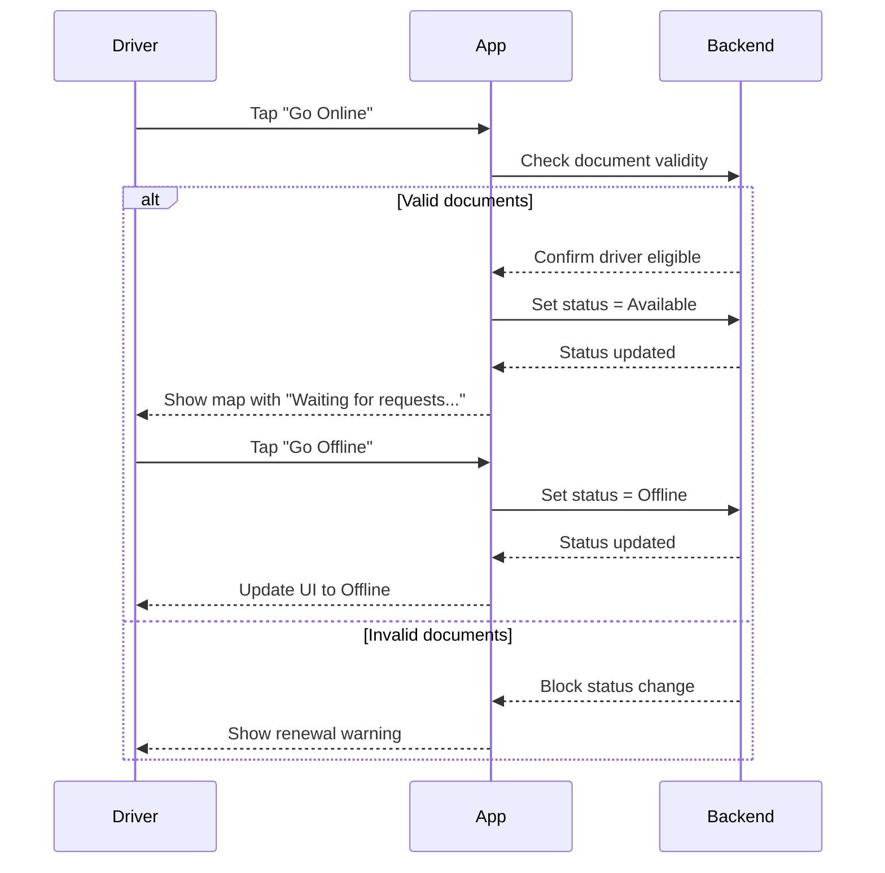

# B.2 Go Online / Offline (MVP)

## Core Scenario

### Use-Case Title

B.2 Go Online / Offline

### Primary Actor

Verified Driver

### Trigger Event

Driver taps the "Go Online" or "Go Offline" toggle on the dashboard

### Pre-conditions

* Driver account status must be "Active"
* Location permission must be granted

### Main Success Flow

**Step One:** On dashboard, driver taps the "Go Online" toggle

**Step Two:** System checks that driver documents (e.g., license, insurance) are current and valid

**Step Three:** If valid, system sets status to "Available"

**Step Four:** Map screen appears with a "Waiting for requests..." banner

**Step Five:** When driver taps the toggle again, system sets status to "Offline"

### Post-conditions

* Driver's availability status is updated appropriately in the system ("Available" or "Offline")
* Rider matching logic respects the driver’s updated status

## Standard Alternate / Error Paths

### A-1

**Condition / Branch:** Documents are expired or invalid
**Expected Behaviour:** System prevents status change and displays a warning with link to update documents

### A-2

**Condition / Branch:** Driver tries to go online without location permission
**Expected Behaviour:** System blocks toggle and prompts user to enable location permission

## Edge & Stretch Scenarios

### E-1

**Category:** Connectivity
**Scenario:** Device loses internet during toggle operation
**Release tag:** Stretch
**Expected Behaviour:** System retries the request or shows an error and retains current status

### E-2

**Category:** Permissions
**Scenario:** User denies or revokes location access mid-session
**Release tag:** Stretch
**Expected Behaviour:** System immediately sets driver to Offline and shows permission alert

### E-3

**Category:** Accessibility
**Scenario:** Driver switches to high-contrast mode while online
**Release tag:** Stretch
**Expected Behaviour:** UI adjusts seamlessly without interrupting online status

### E-4

**Category:** Performance
**Scenario:** System is syncing large trip history or logs
**Release tag:** Stretch
**Expected Behaviour:** Status toggle remains responsive; syncs run in background

## Acceptance Criteria (G/W/T)

**Given** the driver is active and has granted location permission
**When** they tap the "Go Online" toggle
**Then** the system validates documents, sets status to Available, and shows the map screen

**Given** the driver's documents are expired
**When** they attempt to go online
**Then** the system blocks the action and shows a warning

**Given** the driver is online
**When** they tap the toggle to go offline
**Then** the system sets their status to Offline and updates the UI accordingly

---

## Mermaid Sequence Diagram

