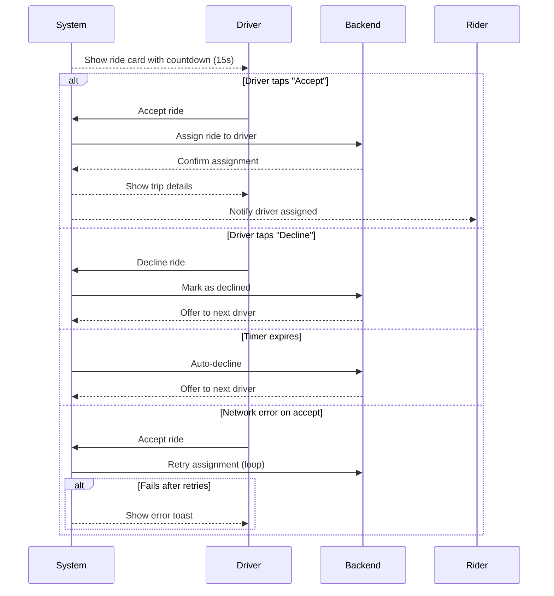

# B.3 Accept / Decline Ride (MVP)

## Core Scenario

### Use-Case Title

B.3 Accept / Decline Ride

### Primary Actor

Online Driver

### Trigger Event

System receives a new ride request for an available driver

### Pre-conditions

* Driver's status must be "Available"
* At least one ride request must be queued

### Main Success Flow

**Step One:** System displays ride offer card (includes pickup location, distance, rider rating, estimated trip length)

**Step Two:** 15-second countdown timer begins

**Step Three:**

* If driver taps “Accept”: System assigns ride, confirms to backend, and pushes trip details to both driver and rider
* If driver taps “Decline”: System marks request as declined and offers it to the next available driver

### Post-conditions

* Ride request is either accepted (driver is assigned) or declined (driver remains available and next driver is prompted)

## Standard Alternate / Error Paths

### A-1

**Condition / Branch:** Driver does not respond in 15 seconds
**Expected Behaviour:** System auto-declines the ride and driver remains in "Available" state

### A-2

**Condition / Branch:** Network loss during ride acceptance
**Expected Behaviour:** System retries backend confirmation for a short window; on failure, displays error toast and leaves request unassigned

## Edge & Stretch Scenarios

### E-1

**Category:** Connectivity
**Scenario:** Device goes offline during countdown
**Release tag:** Stretch
**Expected Behaviour:** System auto-declines request silently and logs event

### E-2

**Category:** Permissions
**Scenario:** User disables location during active ride matching
**Release tag:** Stretch
**Expected Behaviour:** App prompts user and immediately sets driver to Offline

### E-3

**Category:** Accessibility
**Scenario:** Driver activates screen reader or high-contrast mode
**Release tag:** Stretch
**Expected Behaviour:** Ride card is fully navigable and readable with accessibility support

### E-4

**Category:** Performance
**Scenario:** Backend processing delay (e.g., surge dispatch load)
**Release tag:** Stretch
**Expected Behaviour:** Timer extends by 5 seconds and displays "Matching load" banner

## Acceptance Criteria (G/W/T)

**Given** the driver is Available and a ride request is queued
**When** the system shows the ride card and the driver taps “Accept” within 15 seconds
**Then** the ride is assigned and details are shared with both driver and rider

**Given** the driver does not respond within 15 seconds
**When** the timer expires
**Then** the system auto-declines the ride and offers it to another driver

**Given** the driver attempts to accept but there is a network issue
**When** the system retries but fails
**Then** an error toast appears and the request is not assigned

---

## Mermaid Sequence Diagram

