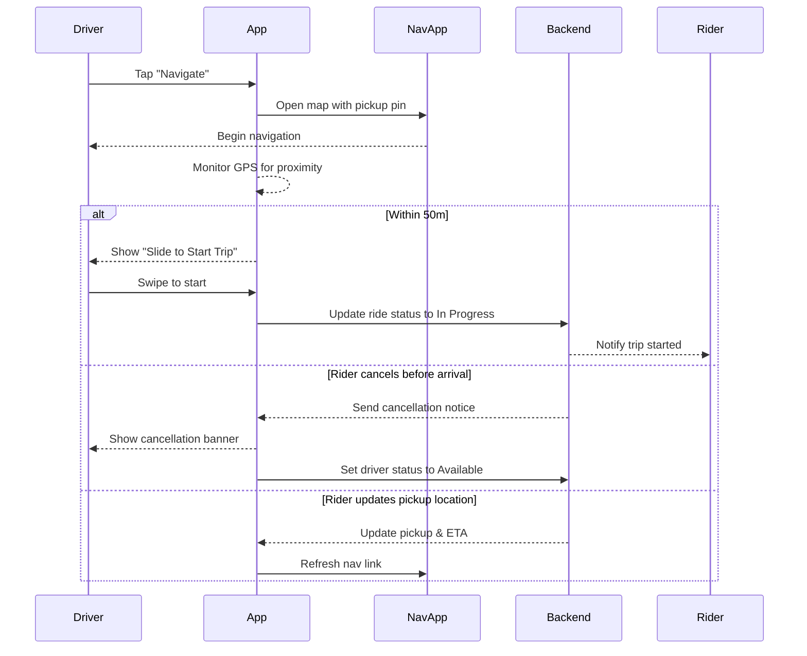

# B.4 Navigate to Pickup & Start Trip (MVP)

## Core Scenario

### Use-Case Title

B.4 Navigate to Pickup & Start Trip

### Primary Actor

Assigned Driver

### Trigger Event

Driver is assigned a ride and begins navigation to pickup location

### Pre-conditions

* Ride status is "Driver En Route"

### Main Success Flow

**Step One:** Driver taps “Navigate” button in the app

**Step Two:** App deep-links to external navigation app (Google Maps/Waze) with pickup pin

**Step Three:** On arrival (within 50 meters), app automatically displays "Slide to Start Trip"

**Step Four:** Driver swipes to start trip → system updates status to "In Progress" and notifies rider

### Post-conditions

* Ride status is updated to "In Progress"
* Rider is notified that the trip has begun
* Navigation switches to drop-off destination if supported

## Standard Alternate / Error Paths

### A-1

**Condition / Branch:** Rider cancels before arrival
**Expected Behaviour:** System displays cancellation banner, resets driver status to "Available"

### A-2

**Condition / Branch:** Rider updates pickup location while en route
**Expected Behaviour:** System updates navigation link and estimated arrival time

## Edge & Stretch Scenarios

### E-1

**Category:** Connectivity
**Scenario:** Device loses signal during navigation
**Release tag:** Stretch
**Expected Behaviour:** Navigation app continues with cached route; app syncs when back online

### E-2

**Category:** Permissions
**Scenario:** User revokes location access before or during navigation
**Release tag:** Stretch
**Expected Behaviour:** App prompts to re-enable location and halts ride progression

### E-3

**Category:** Accessibility
**Scenario:** Driver enables screen reader or high-contrast mode mid-ride
**Release tag:** Stretch
**Expected Behaviour:** UI adapts without disrupting navigation or ride control

### E-4

**Category:** Performance
**Scenario:** Large app payload syncs while navigating
**Release tag:** Stretch
**Expected Behaviour:** Navigation remains responsive; sync continues in background

## Acceptance Criteria (G/W/T)

**Given** the ride status is "Driver En Route"
**When** the driver taps “Navigate”
**Then** the app deep-links to the navigation app with pickup pin

**Given** the driver arrives within 50m of pickup location
**When** the app detects proximity
**Then** it displays "Slide to Start Trip" control

**Given** the driver swipes to start trip
**When** the gesture is complete
**Then** the system updates ride status to "In Progress" and notifies the rider

**Given** the rider cancels before pickup
**When** the cancellation is received
**Then** the app shows a cancellation banner and driver status reverts to "Available"

---

## Mermaid Sequence Diagram

