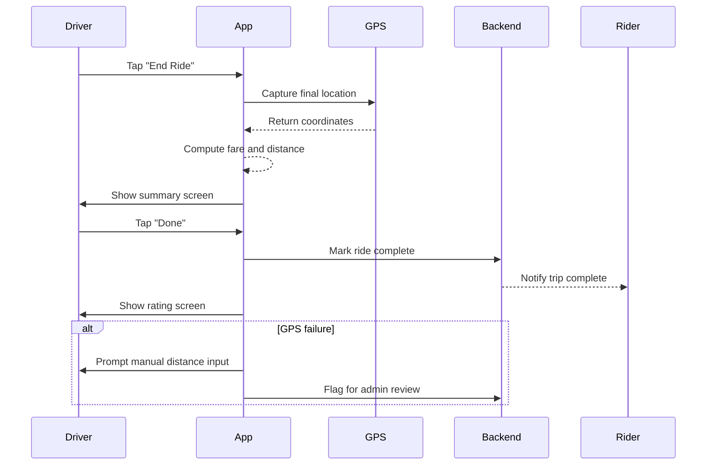

# B.5 Complete Trip & End Ride (MVP)

## Core Scenario

### Use-Case Title

B.5 Complete Trip & End Ride

### Primary Actor

Driver

### Trigger Event

Driver reaches destination and ends the trip

### Pre-conditions

* Ride status is "In Progress"

### Main Success Flow

**Step One:** Driver taps "End Ride" button in the app

**Step Two:** App captures final GPS location, calculates distance-based fare (offline mode)

**Step Three:** Summary screen shows distance, fare, and note: "Ask rider to pay directly"

**Step Four:** Driver taps “Done” → ride is closed, system shows rating screen (linked to B.12)

### Post-conditions

* Ride is marked as completed
* Distance and fare are recorded
* App transitions to post-ride flow (ratings)

## Standard Alternate / Error Paths

### A-1

**Condition / Branch:** Destination changed during trip
**Expected Behaviour:** System recalculates distance before fare summary

### A-2

**Condition / Branch:** GPS error on end-ride
**Expected Behaviour:** Driver can edit distance manually; flagged for admin review

## Edge & Stretch Scenarios

### E-1

**Category:** Connectivity
**Scenario:** Device goes offline during trip end
**Release tag:** Stretch
**Expected Behaviour:** Distance saved locally; syncs once online

### E-2

**Category:** Permissions
**Scenario:** User revokes GPS permission mid-trip
**Release tag:** Stretch
**Expected Behaviour:** App prompts for GPS access or switches to manual distance entry

### E-3

**Category:** Accessibility
**Scenario:** Driver enables screen reader or accessibility settings before ending trip
**Release tag:** Stretch
**Expected Behaviour:** Summary and rating screens remain usable with assistive tools

### E-4

**Category:** Performance
**Scenario:** Background sync delays fare calculation
**Release tag:** Stretch
**Expected Behaviour:** UI shows loading spinner; retry logic in background

## Acceptance Criteria (G/W/T)

**Given** the ride status is "In Progress"
**When** the driver taps "End Ride"
**Then** the app captures final GPS and calculates fare

**Given** the trip has ended
**When** the summary is shown
**Then** the driver sees fare, distance, and offline payment notice

**Given** the driver taps "Done"
**When** the ride is confirmed complete
**Then** the rating screen appears

**Given** the GPS fails
**When** distance is invalid
**Then** allow manual input and flag for audit

---

## Mermaid Sequence Diagram

