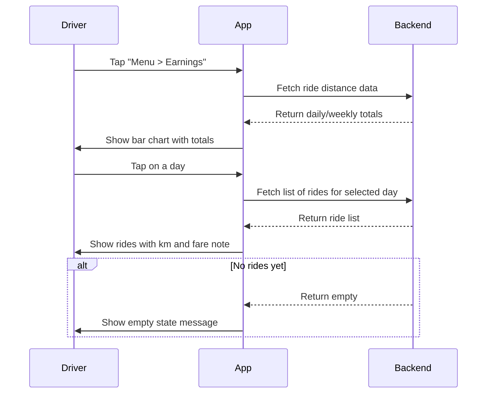

# B.6 Earnings Dashboard (Distance-Only) <MVP>

## Core Scenario

### Use-Case Title

B.6 Earnings Dashboard (Distance-Only)

### Primary Actor

Driver

### Trigger Event

Driver opens the "Earnings" section from the menu

### Pre-conditions

* Driver has completed at least one ride

### Main Success Flow

**Step One:** Driver opens Menu › Earnings
**Step Two:** App loads weekly and daily distance totals
**Step Three:** Bar chart is shown, and tapping a day reveals list of rides with km and a note about fare

### Post-conditions

* Driver views completed rides and total distance driven per day/week

## Standard Alternate / Error Paths

### A-1

**Condition / Branch:** No completed rides
**Expected Behaviour:** System displays empty state with message: “Start driving to see earnings.”

### A-2

**Condition / Branch:** Chart data fails to load due to API timeout
**Expected Behaviour:** Show retry option or error message

## Edge & Stretch Scenarios

### E-1

**Category:** Connectivity
**Scenario:** Device offline when opening dashboard
**Release tag:** Stretch
**Expected Behaviour:** Show cached data or prompt retry

### E-2

**Category:** Permissions
**Scenario:** Driver disables location after rides
**Release tag:** Stretch
**Expected Behaviour:** Distance computed from stored data; no permission prompt needed

### E-3

**Category:** Accessibility
**Scenario:** Driver uses large text mode
**Release tag:** Stretch
**Expected Behaviour:** Chart and list layout adapt responsively

### E-4

**Category:** Performance
**Scenario:** Backend returns high-volume data
**Release tag:** Stretch
**Expected Behaviour:** Lazy-load rides or paginate results

## Acceptance Criteria (G/W/T)

**Given** the driver has completed at least one ride
**When** they open the "Earnings" section
**Then** a bar chart with distance metrics appears

**Given** the driver taps on a day in the chart
**When** that day's data is available
**Then** a list of rides is shown with km and fare note

**Given** the driver has no ride history
**When** they open "Earnings"
**Then** an empty-state message is shown

---

## Mermaid Sequence Diagram

