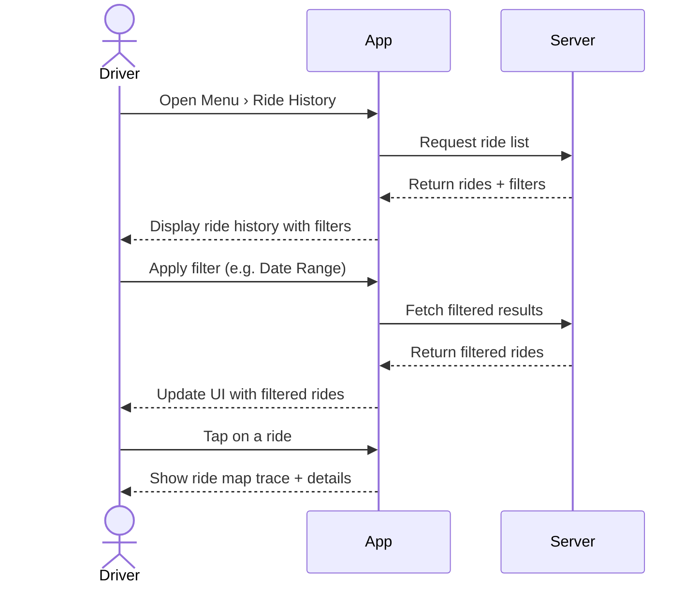

## B.7 – View Ride History & Filters <MVP>

### Core Scenario

**Primary actor**
Driver

**Trigger event**
Driver selects "Ride History" from the menu

**Pre-conditions**
• User logged in

### Main Success Flow

**Step one**
Driver opens Menu → Ride History

**Step two**
System loads ride list and shows filter chips for date range, status

**Step three**
Driver selects a ride → system shows map trace and rider details

### Post-conditions

• Driver has viewed a specific ride’s details

---

### Standard Alternate / Error Paths

**A-1**
– Condition / Branch: Large ride history (>50)
– Expected behaviour: System paginates after 50 rides

**A-2**
– Condition / Branch: No rides match filter criteria
– Expected behaviour: Show empty-state message “No rides found in this range”

---

### Edge & Stretch Scenarios

**E-1**
– Category: Connectivity
– Scenario: Device goes offline during ride list load
– Release tag: Stretch

**E-2**
– Category: Permissions
– Scenario: User denies location on first launch
– Release tag: Stretch

**E-3**
– Category: Accessibility
– Scenario: Switch to high-contrast mid-use
– Release tag: Stretch

**E-4**
– Category: Performance
– Scenario: Large payload of ride history received
– Release tag: Stretch

---

### Acceptance-Criteria Stencil (G/W/T)

**Given** user is logged in and opens Ride History
**When** the ride list loads
**Then** filters are shown and selecting a ride displays its details

---

### Mermaid Sequence Diagram

