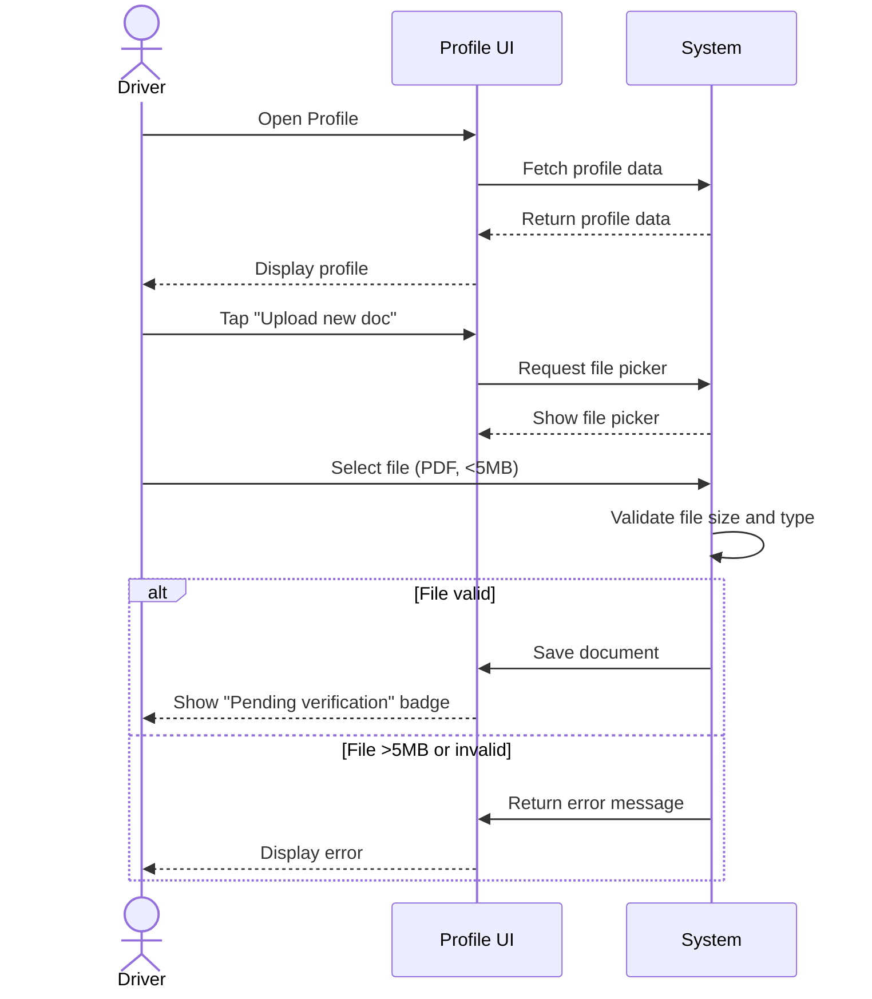

**Use-Case ID**: B.8
**Use-Case Title**: Profile & Document Management
**Release**: MVP / Phase-2

## Core Scenario

**Primary actor**: Driver
**Trigger event**: Driver selects “Profile” from main menu
**Pre-conditions**:

* Driver is successfully logged into the system

**Main Success Flow**:

1. System displays the driver’s profile page.
2. Driver edits personal info or taps “Upload new document”.
3. System opens file picker for document selection.
4. Driver selects a valid document (e.g., insurance).
5. System validates file size and type.
6. System stores document and marks it for verification.
7. System shows “Pending verification” badge next to the document.

**Post-conditions**:

* The new document is saved and flagged as “Pending verification”.

## Standard Alternate / Error Paths

**A-1 – File > 5 MB**

* Condition: Selected file size exceeds 5 MB
* Expected behaviour: System rejects file and displays “File too large. Please upload a file under 5 MB.”

**A-2 – Invalid file type**

* Condition: Selected file type is not among accepted formats (PDF, JPG, PNG)
* Expected behaviour: System rejects file and displays “Invalid file type. Accepted: PDF, JPG, PNG.”

## Edge & Stretch Scenarios

**E-1 – Connectivity (Stretch)**

* Scenario: Device goes offline during document upload
* Release tag: Stretch

**E-2 – Permissions (Stretch)**

* Scenario: User denies storage permission on first upload
* Release tag: Stretch

**E-3 – Accessibility (Stretch)**

* Scenario: Switch to high-contrast mode mid-interaction
* Release tag: Stretch

**E-4 – Performance (Stretch)**

* Scenario: Large payload arrives during sync
* Release tag: Stretch

## Acceptance Criteria (Gherkin)

```gherkin
Given Driver is logged in
When Driver uploads a document under 5 MB of type PDF, JPG, or PNG
Then System stores the document and displays “Pending verification”

Given Driver selects a file > 5 MB
When Driver attempts to upload
Then System displays “File too large. Please upload a file under 5 MB.”

Given Driver selects a file of invalid type
When Driver attempts to upload
Then System displays “Invalid file type. Accepted: PDF, JPG, PNG.”
```

## Sequence Diagram


