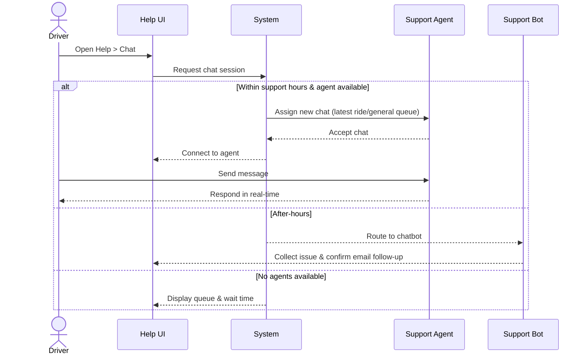

**Use-Case ID**: B.9
**Use-Case Title**: In-App Support Chat (Driver)
**Release**: MVP / Phase-2

## Core Scenario

**Primary actor**: Driver
**Trigger event**: Driver selects “Chat” from the Help section
**Pre-conditions**:

* Driver is successfully logged into the system

**Main Success Flow**:

1. Driver navigates to Help > Chat.
2. System opens a chat session: either linked to the driver’s latest ride or added to a general support queue.
3. Messages are exchanged in real-time between the driver and a support agent.
4. Issue is resolved or session is closed by agent or driver.

**Post-conditions**:

* A support conversation is initiated and logged. The driver receives appropriate support or follow-up.

## Standard Alternate / Error Paths

**A-1 – After-hours support**

* Condition: Chat accessed during off-hours (e.g., late night)
* Expected behaviour: A bot collects the issue details and promises email follow-up.

**A-2 – No agent available**

* Condition: All agents are currently busy
* Expected behaviour: System places driver in queue and displays estimated wait time.

## Edge & Stretch Scenarios

**E-1 – Connectivity (Stretch)**

* Scenario: Device goes offline during live chat
* Release tag: Stretch

**E-2 – Permissions (Stretch)**

* Scenario: User denies notification permission (for new replies)
* Release tag: Stretch

**E-3 – Accessibility (Stretch)**

* Scenario: Switch to high-contrast mode mid-chat
* Release tag: Stretch

**E-4 – Performance (Stretch)**

* Scenario: Heavy load delays message delivery
* Release tag: Stretch

## Acceptance Criteria (Gherkin)

```gherkin
Given Driver is logged in
When Driver navigates to Help > Chat
Then System connects them to a support agent or queue

Given Support hours are closed
When Driver initiates chat
Then A bot collects issue and confirms email follow-up

Given No agents are available
When Driver initiates chat
Then System queues the driver and shows estimated wait time
```

## Sequence Diagram


