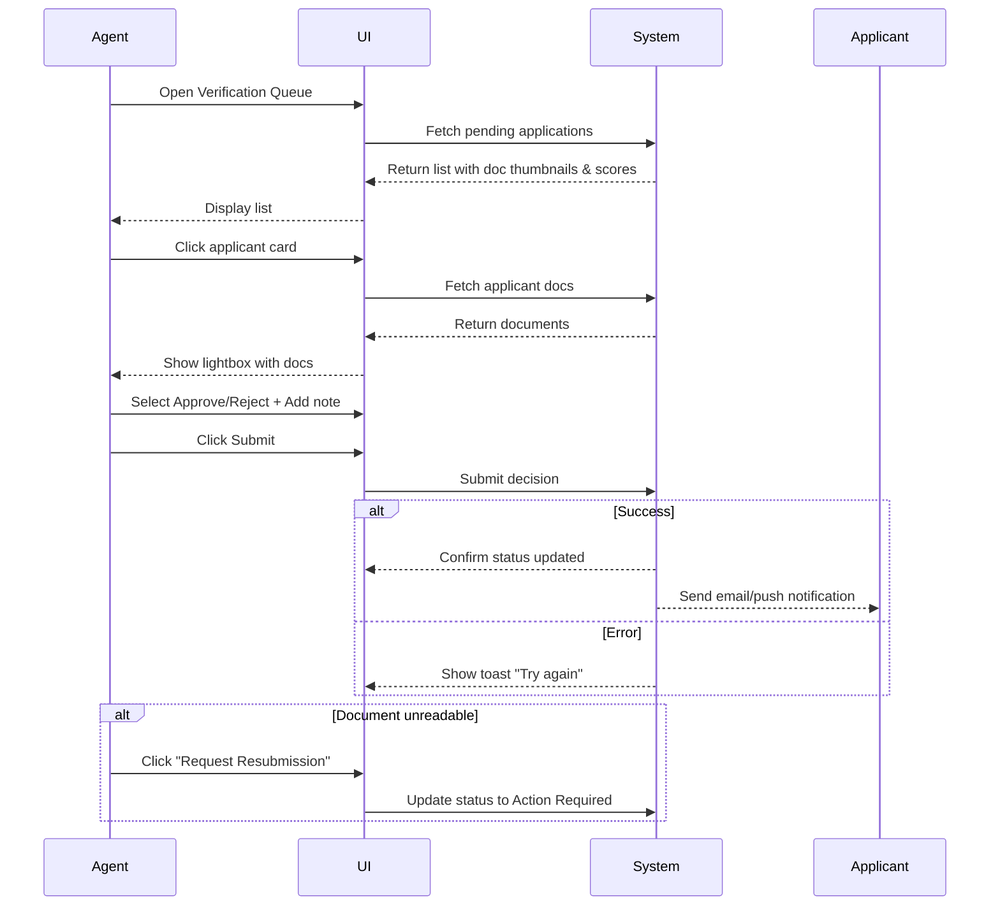

# C.1 Approve / Reject Driver Applications

**Actor:** Operations Agent
**Pre-conditions:**

* Agent logged in with Driver-Review role
* Pending applications exist

## Core Scenario

### Primary Actor

Operations Agent

### Trigger Event

Agent accesses the Verification Queue to process driver applications.

### Pre-conditions

* Agent has a valid session with Driver-Review role
* One or more pending driver applications exist

### Main Success Flow

**Step One:** Agent opens Drivers > Verification Queue
**Step Two:** System displays a list of applicants with document thumbnails and background-check scores
**Step Three:** Agent clicks a card to review; a lightbox opens to show documents
**Step Four:** Agent selects Approve or Reject, optionally adds a note, then clicks Submit
**Step Five:** System updates driver status and triggers email/push notification to the applicant

### Post-conditions

* Driver's application is updated to Approved or Rejected
* Notification sent to applicant

## Standard Alternate / Error Paths

### A-1

**Condition / Branch:** Document unreadable
**Expected behaviour:** Agent clicks “Request Resubmission”; status is set to Action Required

### A-2

**Condition / Branch:** Unexpected error saving decision
**Expected behaviour:** System shows toast “Try again” and does not change status

## Edge & Stretch Scenarios

### E-1

**Category:** Connectivity
**Scenario:** Device goes offline during document review
**Release tag:** Stretch

### E-2

**Category:** Permissions
**Scenario:** User denies location on first launch (not critical in this flow)
**Release tag:** Stretch

### E-3

**Category:** Accessibility
**Scenario:** Agent switches to high-contrast mode mid-review
**Release tag:** Stretch

### E-4

**Category:** Performance
**Scenario:** Large payload (many applicants) slows rendering
**Release tag:** Stretch

## Acceptance Criteria (G/W/T)

**Given** the agent is logged in and applications are pending
**When** the agent approves or rejects an application
**Then** the system updates the status and sends a notification

**Given** the agent views an unreadable document
**When** they request a resubmission
**Then** the system marks the application as Action Required

**Given** a decision submission fails due to a backend issue
**When** the agent clicks Submit
**Then** the system shows a toast message: "Try again"

## Mermaid Sequence Diagram

# C.1 Approve / Reject Driver Applications

**Actor:** Operations Agent
**Pre-conditions:**

* Agent logged in with Driver-Review role
* Pending applications exist

## Core Scenario

### Primary Actor

Operations Agent

### Trigger Event

Agent accesses the Verification Queue to process driver applications.

### Pre-conditions

* Agent has a valid session with Driver-Review role
* One or more pending driver applications exist

### Main Success Flow

**Step One:** Agent opens Drivers > Verification Queue
**Step Two:** System displays a list of applicants with document thumbnails and background-check scores
**Step Three:** Agent clicks a card to review; a lightbox opens to show documents
**Step Four:** Agent selects Approve or Reject, optionally adds a note, then clicks Submit
**Step Five:** System updates driver status and triggers email/push notification to the applicant

### Post-conditions

* Driver's application is updated to Approved or Rejected
* Notification sent to applicant

## Standard Alternate / Error Paths

### A-1

**Condition / Branch:** Document unreadable
**Expected behaviour:** Agent clicks “Request Resubmission”; status is set to Action Required

### A-2

**Condition / Branch:** Unexpected error saving decision
**Expected behaviour:** System shows toast “Try again” and does not change status

## Edge & Stretch Scenarios

### E-1

**Category:** Connectivity
**Scenario:** Device goes offline during document review
**Release tag:** Stretch

### E-2

**Category:** Permissions
**Scenario:** User denies location on first launch (not critical in this flow)
**Release tag:** Stretch

### E-3

**Category:** Accessibility
**Scenario:** Agent switches to high-contrast mode mid-review
**Release tag:** Stretch

### E-4

**Category:** Performance
**Scenario:** Large payload (many applicants) slows rendering
**Release tag:** Stretch

## Acceptance Criteria (G/W/T)

**Given** the agent is logged in and applications are pending
**When** the agent approves or rejects an application
**Then** the system updates the status and sends a notification

**Given** the agent views an unreadable document
**When** they request a resubmission
**Then** the system marks the application as Action Required

**Given** a decision submission fails due to a backend issue
**When** the agent clicks Submit
**Then** the system shows a toast message: "Try again"

## Mermaid Sequence Diagram

