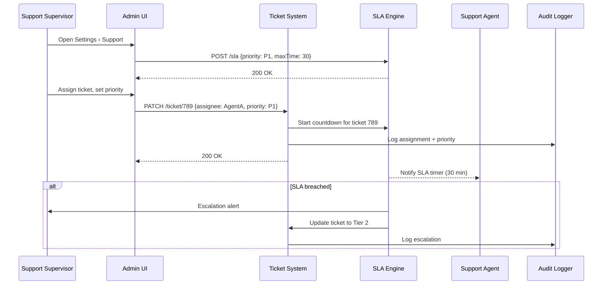

# C.10 Enhanced Support & Ticket Workflows – Use Case (MVP)

## Core Scenario

### Primary Actor  
Support Supervisor

### Trigger Event  
Supervisor opens **Settings › Support** and defines SLA rules, or assigns a ticket from the queue.

### Pre‑conditions  
* Supervisor is authenticated and has ticket management permissions.  
* Ticket exists in the queue and is unassigned or under triage.  

### Main Success Flow  
1. Supervisor opens **Settings › Support** and configures SLA (e.g. P1 ≤ 30 min).  
2. Navigates to ticket queue, assigns an agent and sets ticket priority.  
3. System begins SLA countdown and sets reminders and visual timers.  
4. Agent sees the ticket in their view with deadline indicators.  
5. Ticket is resolved or responded to within SLA time.  

### Post‑conditions  
* SLA timers are cleared or marked as met/failed.  
* Audit log updated with assignment, priority, and resolution time.  
* System performance metrics (SLA compliance) are updated.

---

## Standard Alternate / Error Paths

| ID | Condition / Branch | Expected Behaviour |
|----|--------------------|--------------------|
| A‑1 | **SLA is breached** | System auto‑escalates to next support tier or reassigns ticket. |
| A‑2 | **Ticket unassigned after threshold** | Supervisor receives alert to reassign or follow-up. |

---

## Edge & Stretch Scenarios

| ID | Category | Scenario | Release Tag |
|----|----------|----------|-------------|
| E‑1 | Connectivity | Supervisor loses connection during SLA config → auto-save resumes on reconnect. | Stretch |
| E‑2 | Permissions | Agent tries to edit ticket priority → denied unless supervisor. | Stretch |
| E‑3 | Accessibility | SLA countdown visible with ARIA and screen reader compatibility. | Stretch |
| E‑4 | Performance | Bulk SLA updates (100+ tickets) → countdowns remain in sync with low latency. | Stretch |

---

## Acceptance‑Criteria (G / W / T)

1. **Set and enforce SLA**  
   *Given* a P1 SLA of 30 minutes is configured  
   *When* a ticket is assigned with P1 priority  
   *Then* the system starts a 30-minute countdown, highlights urgency, and alerts if breached.

2. **Auto escalation**  
   *Given* a ticket is overdue by SLA threshold  
   *When* no action is taken by the assigned agent  
   *Then* the system escalates the ticket to Tier 2 support automatically.

---

## Sequence Diagram

---

*Last updated: 07 July 2025*
