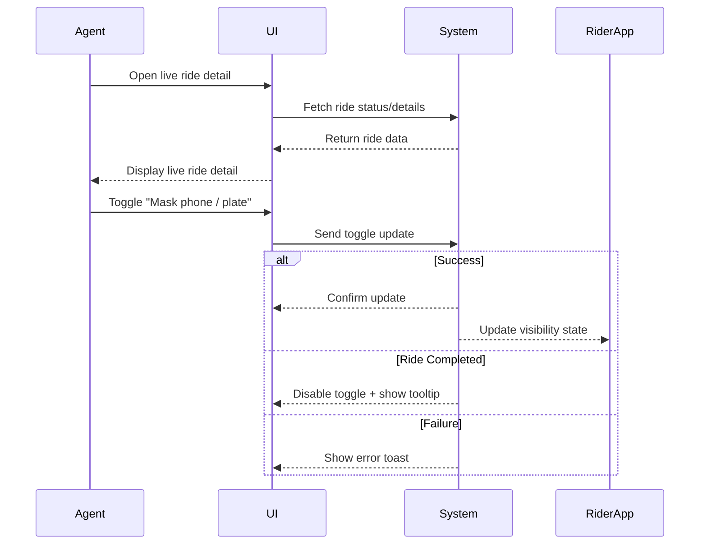

# C.2 Show / Hide Driver Details to Clients

**Actor:** Operations Agent
**Pre-conditions:**

* Ride is either assigned or currently in progress

## Core Scenario

### Primary Actor

Operations Agent

### Trigger Event

Agent accesses a live ride detail view and wants to control visibility of driver’s phone/plate to the rider.

### Pre-conditions

* Ride is assigned or in progress

### Main Success Flow

**Step One:** Agent opens live ride detail
**Step Two:** Agent toggles the “Mask phone / plate” switch
**Step Three:** System updates the real-time feed; rider app either hides or reveals driver’s phone and license plate information

### Post-conditions

* Driver’s details (phone and plate) are masked or visible depending on the toggle
* The rider app reflects the change in real time

## Standard Alternate / Error Paths

### A-1

**Condition / Branch:** Ride already completed
**Expected behaviour:** Toggle is disabled; system shows tooltip “Cannot change after completion.”

### A-2

**Condition / Branch:** Toggle fails due to temporary backend issue
**Expected behaviour:** System shows error toast “Unable to update visibility, please try again.”

## Edge & Stretch Scenarios

### E-1

**Category:** Connectivity
**Scenario:** Agent’s device goes offline while toggling visibility
**Release tag:** Stretch

### E-2

**Category:** Permissions
**Scenario:** User denies location on first launch (non-blocking)
**Release tag:** Stretch

### E-3

**Category:** Accessibility
**Scenario:** Agent switches to high-contrast mode mid-interaction
**Release tag:** Stretch

### E-4

**Category:** Performance
**Scenario:** Multiple concurrent toggles during a high-traffic window
**Release tag:** Stretch

## Acceptance Criteria (G/W/T)

**Given** a ride is active (assigned or in progress)
**When** the agent toggles the “Mask phone / plate” switch
**Then** the system updates the visibility in the rider app in real time

**Given** the ride is completed
**When** the agent views the toggle
**Then** the toggle is disabled and a tooltip explains “Cannot change after completion.”

**Given** a backend failure during toggle
**When** the agent attempts to mask/unmask info
**Then** the system shows an error toast and does not change visibility

## Mermaid Sequence Diagram

