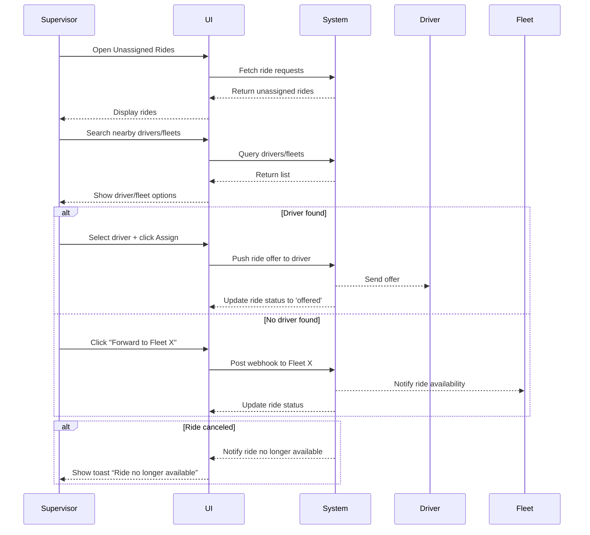

# C.3 Assign Driver Manually / Forward to Fleet

**Actor:** Dispatch Supervisor
**Pre-conditions:**

* Ride request is unassigned due to auto-assignment being off or having failed

## Core Scenario

### Primary Actor

Dispatch Supervisor

### Trigger Event

Supervisor needs to assign a driver manually or forward the request to a partner fleet

### Pre-conditions

* At least one ride request is waiting in the unassigned state

### Main Success Flow

**Step One:** Supervisor opens Unassigned Rides view
**Step Two:** Supervisor searches nearby drivers or partner fleets
**Step Three:** Supervisor selects a driver and clicks Assign
**Step Four:** System pushes the ride offer to the selected driver and updates the ride status to 'offered'

### Post-conditions

* Ride is either assigned to a driver or forwarded to a fleet
* System reflects the updated status appropriately

## Standard Alternate / Error Paths

### A-1

**Condition / Branch:** No driver found nearby
**Expected behaviour:** Supervisor clicks “Forward to Fleet X”; system posts a webhook to the fleet endpoint

### A-2

**Condition / Branch:** Ride status changes mid-process (e.g., canceled by rider)
**Expected behaviour:** System shows toast “Ride no longer available”; cancels action

## Edge & Stretch Scenarios

### E-1

**Category:** Connectivity
**Scenario:** Supervisor’s device goes offline while searching for drivers
**Release tag:** Stretch

### E-2

**Category:** Permissions
**Scenario:** Location permissions denied, making it harder to determine nearby drivers
**Release tag:** Stretch

### E-3

**Category:** Accessibility
**Scenario:** Supervisor switches to high-contrast mode during assignment
**Release tag:** Stretch

### E-4

**Category:** Performance
**Scenario:** Unassigned queue loads hundreds of requests and slows UI
**Release tag:** Stretch

## Acceptance Criteria (G/W/T)

**Given** a ride is unassigned and auto-assignment has failed
**When** the supervisor selects a driver and clicks Assign
**Then** the system pushes the offer and updates the ride status to 'offered'

**Given** no drivers are found
**When** the supervisor clicks “Forward to Fleet X”
**Then** the system posts a webhook to Fleet X and updates the status accordingly

**Given** the ride gets canceled during the assignment flow
**When** the supervisor clicks Assign
**Then** the system shows a toast: “Ride no longer available”

## Mermaid Sequence Diagram

