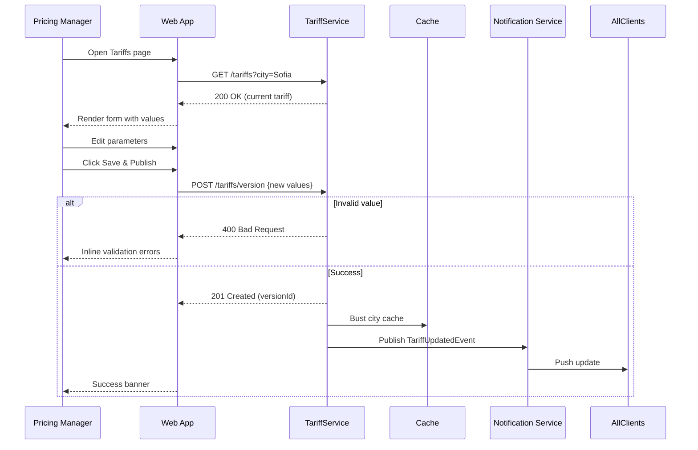

# C.4 Configure Pricing Parameters – Use Case (MVP)

## Core Scenario

### Primary Actor
Pricing Manager

### Trigger Event
Pricing Manager selects **Settings › Tariffs** in the admin console.

### Pre‑conditions
* Pricing Manager is authenticated and has the **Tariff‑Admin** role.
* Desired city already exists in the system catalog.

### Main Success Flow
1. Pricing Manager navigates to **Settings › Tariffs**.
2. System displays the list of cities with current pricing parameters.
3. Pricing Manager selects a city to edit.
4. System shows current tariff values:
   * Base Fare  
   * Per‑kilometre rate  
   * Per‑minute rate  
   * Surge Multiplier
5. Pricing Manager updates one or more values.
6. Pricing Manager clicks **Save & Publish**.
7. System validates all inputs.
8. System versions the tariff and stores the new record.
9. System busts relevant caches and propagates the change to downstream services.
10. System shows a confirmation banner: *“Tariff v23 published for Sofia.”*

### Post‑conditions
* A new tariff version exists for the selected city.
* All pricing services are serving the updated parameters within 60 seconds.

---

## Standard Alternate / Error Paths

| ID | Condition / Branch | Expected Behaviour |
|----|--------------------|--------------------|
| A‑1 | **Invalid value** (negative, blank, or non‑numeric) | System blocks save, highlights offending field, and displays inline validation message. |
| A‑2 | **Concurrent edit** – another admin publishes a newer version while the form is open | System warns of a newer version and offers *Reload* or *Overwrite*. |

---

## Edge & Stretch Scenarios

| ID | Category | Scenario | Release Tag |
|----|----------|----------|-------------|
| E‑1 | Connectivity | Device goes offline after step 3; local edits are cached and auto‑submitted once connection returns. | Stretch |
| E‑2 | Permissions | User without **Tariff‑Admin** role attempts to open Tariffs; access is denied with guidance to request the role. | Stretch |
| E‑3 | Accessibility | User switches to high‑contrast mode mid‑edit; UI re‑renders with accessible colours, retaining form state. | Stretch |
| E‑4 | Performance | Large payload (≥1 MB) arrives while syncing tariff versions; UI remains responsive via streaming list rendering. | Stretch |

---

## Acceptance‑Criteria (G / W / T)

1. **Happy path**  
   *Given* a Pricing Manager with the Tariff‑Admin role is viewing tariffs for **Sofia**  
   *When* they set **Base Fare = 2.00**, **Per‑km = 1.20**, **Per‑minute = 0.25**, **Surge = 1.0** and press **Save & Publish**  
   *Then* the system creates a new tariff version, propagates it to all services, and shows a success banner within 2 seconds.

2. **Validation**  
   *Given* the manager enters **Per‑km = –1.00**  
   *When* they press **Save & Publish**  
   *Then* the field is highlighted, a message “Rate must be ≥ 0” appears, and no changes are persisted.

---

## Sequence Diagram

---

*Last updated: 07 July 2025*
