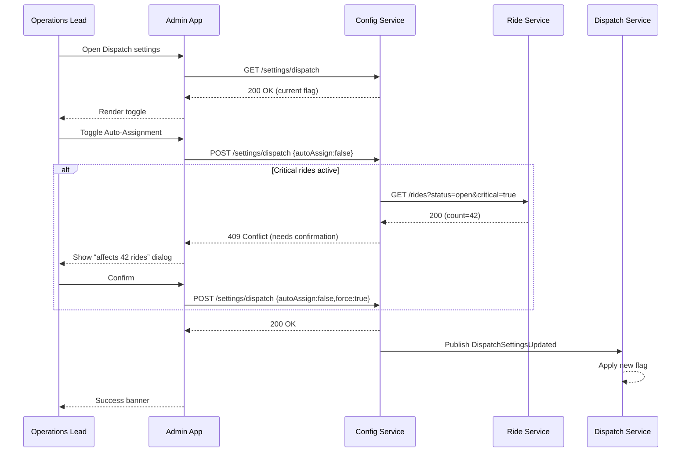

# C.5 Enable / Disable Auto‑Assignment – Use Case (MVP)

## Core Scenario

### Primary Actor
Operations Lead

### Trigger Event
Operations Lead opens **Settings › Dispatch** in the admin console.

### Pre‑conditions
* Feature flag **Auto‑Assignment** is available in the environment.
* Operations Lead is authenticated with the **Dispatch‑Admin** role.
* At least one dispatch region (global or city‑specific) exists.

### Main Success Flow
1. Operations Lead navigates to **Settings › Dispatch**.
2. System displays the current Auto‑Assignment toggle (global and per‑city).
3. Operations Lead flips the toggle to the desired state.
4. System checks for open *critical* rides.
5. System saves the new configuration.
6. System broadcasts a **DispatchSettingsUpdated** event to the dispatch service.
7. Dispatch service applies the new flag immediately.
8. UI shows confirmation: *“Auto‑assignment disabled for Sofia.”*

### Post‑conditions
* Auto‑assignment flag is updated and in effect across all dispatch nodes within 30 seconds.
* Configuration service stores an audit log entry with user, timestamp, and previous value.

---

## Standard Alternate / Error Paths

| ID | Condition / Branch | Expected Behaviour |
|----|--------------------|--------------------|
| A‑1 | **Critical rides active** (≥1 open ride with priority “critical”) | System shows a confirmation dialog: “This will affect *${count}* open rides – continue?”. User must confirm to proceed. |
| A‑2 | **Concurrent update** – another admin changes the flag after the form loads | System detects version mismatch, prompts user to reload, and prevents silent overwrite. |

---

## Edge & Stretch Scenarios

| ID | Category | Scenario | Release Tag |
|----|----------|----------|-------------|
| E‑1 | Connectivity | Device goes offline after step 3; UI queues the change locally and retries on reconnect. | Stretch |
| E‑2 | Permissions | User without **Dispatch‑Admin** role attempts to toggle; access is denied with actionable message. | Stretch |
| E‑3 | Accessibility | User switches to high‑contrast mode mid‑edit; UI re‑renders accessibly, preserving toggle state. | Stretch |
| E‑4 | Performance | Large payload (>1 MB ride list) arrives during critical‑ride check; service streams results to keep UI responsive. | Stretch |

---

## Acceptance‑Criteria (G / W / T)

1. **Happy path**  
   *Given* an Operations Lead with **Dispatch‑Admin** role views dispatch settings for **Global**  
   *When* they disable Auto‑Assignment and confirm  
   *Then* the new flag is stored, an event is broadcast, and the UI shows success within 3 seconds.

2. **Critical rides confirmation**  
   *Given* 42 critical rides are active in Sofia  
   *When* the lead disables Auto‑Assignment for **Sofia**  
   *Then* the system asks for confirmation and only proceeds after the user confirms.

---

## Sequence Diagram

---

*Last updated: 07 July 2025*
