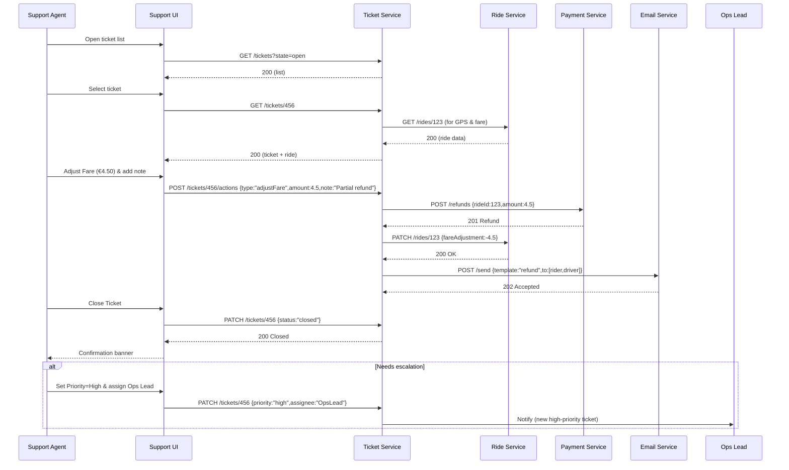

# C.6 Resolve Disputes & Support Tickets – Use Case (MVP)

## Core Scenario

### Primary Actor  
Support Agent

### Trigger Event  
Support Agent selects an **Open** ticket in the Support Console.

### Pre‑conditions  
* Ticket exists in **Open** state.  
* Support Agent is authenticated with **Support‑Agent** role.  
* Ride associated with the ticket is completed and recorded.

### Main Success Flow  
1. Support Agent opens the ticket list and selects a ticket.  
2. System displays ticket details, chat transcript, ride metadata, fare, and GPS trace.  
3. Support Agent chooses **Adjust Fare** or **Issue Refund** (or adds offline note only).  
4. System presents an amount/percentage input; agent confirms.  
5. Support Agent adds a resolution note and clicks **Close Ticket**.  
6. System validates inputs and writes a ticket resolution record.  
7. System updates the ride record and, if applicable, triggers payment adjustment or refund.  
8. System emails both rider and driver with the resolution summary.  
9. Ticket status changes to **Closed**, and UI shows confirmation.

### Post‑conditions  
* Ticket state is **Closed** with an immutable audit trail.  
* Ride record reflects any fare adjustments or refund transactions.  
* Notification emails have been delivered to rider and driver.

---

## Standard Alternate / Error Paths

| ID | Condition / Branch | Expected Behaviour |
|----|--------------------|--------------------|
| A‑1 | **Needs escalation** – Agent determines higher‑level review required | Agent sets **Priority = High** and assigns ticket to **Ops Lead**; ticket remains open. |
| A‑2 | **Policy violation detected** | Agent flags driver; system triggers **C.15 – Driver Suspension Flow** before closing ticket. |

---

## Edge & Stretch Scenarios

| ID | Category | Scenario | Release Tag |
|----|----------|----------|-------------|
| E‑1 | Connectivity | Agent loses network after editing note; changes auto‑saved to local storage and resubmitted on reconnect. | Stretch |
| E‑2 | Permissions | User lacking **Support‑Agent** role attempts to open ticket; access is denied with guidance to request role. | Stretch |
| E‑3 | Accessibility | Agent switches to high‑contrast mode while viewing GPS trace; UI re‑renders with accessible colours. | Stretch |
| E‑4 | Performance | Ticket with >1 000 chat messages loads; UI streams messages incrementally to stay responsive. | Stretch |

---

## Acceptance‑Criteria (G / W / T)

1. **Happy path**  
   *Given* a Support Agent is viewing an **Open** ticket for Ride #123  
   *When* they issue a refund of **€4.50**, add a note “Partial refund for delay”, and click **Close Ticket**  
   *Then* the ride record shows a –€4.50 adjustment, both parties receive an email, and the ticket status becomes **Closed** within 5 seconds.

2. **Escalation**  
   *Given* an agent opens a ticket requiring Ops review  
   *When* they set **Priority = High** and assign **Ops Lead**  
   *Then* the ticket remains **Open**, and Ops Lead receives a notification within 1 minute.

---

## Sequence Diagram

---

*Last updated: 07 July 2025*
