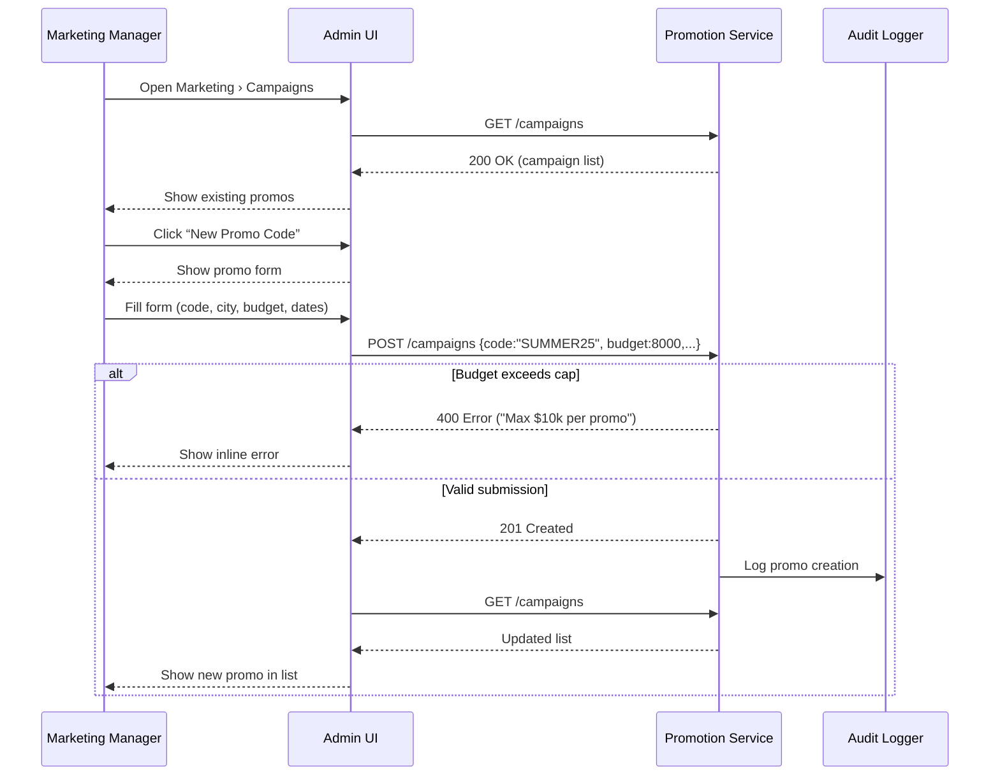

# C.7 Promotion & Campaign Management – Use Case (MVP)

## Core Scenario

### Primary Actor  
Marketing Manager

### Trigger Event  
Marketing Manager opens **Marketing › Campaigns** in the admin console.

### Pre‑conditions  
* User has **Promo‑Admin** role.  
* At least one city is active in the platform.  
* Budget caps are configured in system policy (e.g. $10k per promo).

### Main Success Flow  
1. Marketing Manager navigates to **Marketing › Campaigns**.  
2. System displays current and past campaigns.  
3. Manager clicks **“New Promo Code”**.  
4. Enters promo details: code, target city, total budget, start and end dates.  
5. Clicks **Create**.  
6. System validates inputs, applies business rules (budget caps, date range).  
7. Promo is saved to the campaign system.  
8. Promo appears in the campaign list UI immediately.  

### Post‑conditions  
* New promo is stored and ready for activation based on start date.  
* Audit trail of promo creation is recorded (user, time, IP).  
* Campaign appears in all eligible user funnels (e.g. rider checkout, app banners).

---

## Standard Alternate / Error Paths

| ID | Condition / Branch | Expected Behaviour |
|----|--------------------|--------------------|
| A‑1 | **Budget exceeds allowed cap** (>$10k) | System blocks submission and shows error “Max $10 000 per promo.” |
| A‑2 | **Invalid date range** (e.g. end date before start) | System highlights invalid fields and prevents creation. |

---

## Edge & Stretch Scenarios

| ID | Category | Scenario | Release Tag |
|----|----------|----------|-------------|
| E‑1 | Connectivity | Network drops before Create → system retries with exponential backoff. | Stretch |
| E‑2 | Permissions | User opens campaign page without **Promo‑Admin** → access denied screen shown. | Stretch |
| E‑3 | Accessibility | Agent enables screen reader → campaign form has full label support. | Stretch |
| E‑4 | Performance | Campaign page loads with >100 active promos → lazy-load + pagination keep UI responsive. | Stretch |

---

## Acceptance‑Criteria (G / W / T)

1. **Happy path**  
   *Given* a Marketing Manager with **Promo‑Admin** role  
   *When* they create a promo with code `SUMMER25`, for Sofia, with $8000 budget  
   *Then* the promo is saved, appears in the list, and is eligible for matching rides from the defined start date.

2. **Budget cap enforcement**  
   *Given* the platform limit is $10 000 per promo  
   *When* the manager enters $15 000 as the budget  
   *Then* the form shows an error and prevents saving until the value is reduced.

---

## Sequence Diagram

---

*Last updated: 07 July 2025*
