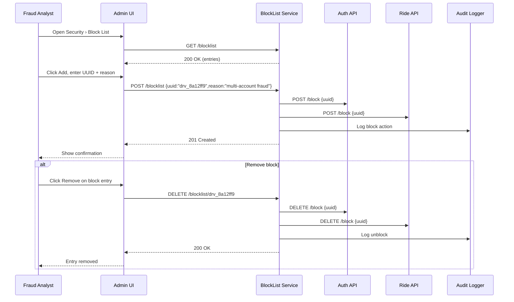

# C.8 Block‑List Management – Use Case (MVP)

## Core Scenario

### Primary Actor  
Fraud Analyst

### Trigger Event  
Fraud Analyst accesses the **Security › Block List** screen in the admin console.

### Pre‑conditions  
* Fraud Analyst is authenticated with appropriate permissions.  
* Rider or driver UUID is available (from incident report or investigation).  

### Main Success Flow  
1. Analyst opens **Security › Block List**.  
2. Clicks **Add**, enters UUID and reason for block.  
3. Clicks **Save**.  
4. System validates the UUID and stores the block record.  
5. Login and ride creation APIs are updated in real-time to deny actions by blocked user.  
6. UI confirms that the block was applied successfully.

### Post‑conditions  
* User is prevented from logging in or starting rides.  
* Block entry appears in block list table with metadata (who, when, why).  
* Changes are audited and propagate to fraud rules and API gatekeepers.

---

## Standard Alternate / Error Paths

| ID | Condition / Branch | Expected Behaviour |
|----|--------------------|--------------------|
| A‑1 | **Invalid UUID** or missing reason | System prevents submission and shows validation error. |
| A‑2 | **Analyst removes an entry** | System deletes block; login/ride APIs allow user access immediately. |

---

## Edge & Stretch Scenarios

| ID | Category | Scenario | Release Tag |
|----|----------|----------|-------------|
| E‑1 | Connectivity | Analyst loses connection after hitting Save → system retries until block confirmed or error shown. | Stretch |
| E‑2 | Permissions | User without correct access attempts to open block list → access denied. | Stretch |
| E‑3 | Accessibility | Analyst uses keyboard navigation and screen reader to manage block list. | Stretch |
| E‑4 | Performance | Block list contains over 10k entries → pagination and search remain fast. | Stretch |

---

## Acceptance‑Criteria (G / W / T)

1. **Block a user**  
   *Given* a Fraud Analyst with access to Security  
   *When* they enter UUID `drv_8a12ff9` with reason “multi-account fraud” and click Save  
   *Then* the user is denied login immediately, and block appears in the UI within 3 seconds.

2. **Remove a block**  
   *Given* a rider UUID is already on the block list  
   *When* the Analyst clicks Remove next to the entry  
   *Then* the system removes the block and restores API access in real time.

---

## Sequence Diagram

---

*Last updated: 07 July 2025*
