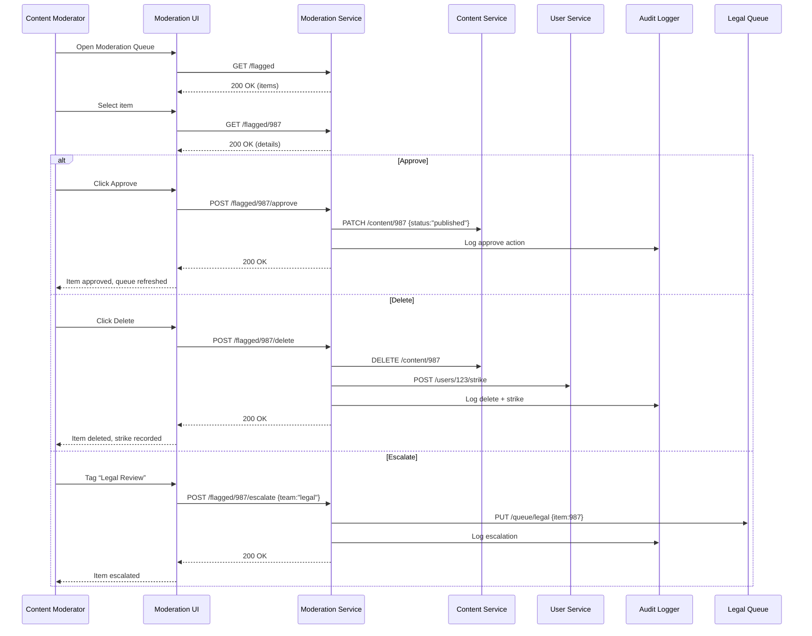

# C.9 Spam Filtering & Content Moderation – Use Case (MVP)

## Core Scenario

### Primary Actor  
Content Moderator

### Trigger Event  
A new review or chat message is auto‑flagged by the ML classifier and appears in the **Moderation Queue**.

### Pre‑conditions  
* Content Moderator is authenticated with **Moderation** privileges.  
* Flagged content exists in the queue with ML spam/abuse score above threshold.  
* User and message IDs are available for further actions (approve, delete, strike).

### Main Success Flow  
1. Content Moderator opens the **Moderation Queue**.  
2. System lists flagged items with metadata and ML score.  
3. Moderator selects an item, reviews text and context.  
4. Moderator clicks **Approve** or **Delete**.  
5. System executes the chosen action:  
   * **Approve** → content status set to *published*, removed from queue.  
   * **Delete** → content removed, user strike count incremented.  
6. System writes an audit log and updates moderation metrics.  
7. UI confirms action, and queue refreshes.

### Post‑conditions  
* Content is either published or removed.  
* If deleted, user’s strike count is increased; further action (e.g. suspension) may be triggered when thresholds are met.  
* Full audit record (who, when, action, reason) is stored.

---

## Standard Alternate / Error Paths

| ID | Condition / Branch | Expected Behaviour |
|----|--------------------|--------------------|
| A‑1 | **Needs escalation** – moderator is unsure or content is sensitive | Moderator tags **“Legal Review”**; item is forwarded to the Legal team queue. |
| A‑2 | **Concurrent action** – item already processed by another moderator | System shows a notice and disables further actions on this item. |

---

## Edge & Stretch Scenarios

| ID | Category | Scenario | Release Tag |
|----|----------|----------|-------------|
| E‑1 | Connectivity | Moderator loses connection after choosing action; UI retries or shows offline banner. | Stretch |
| E‑2 | Permissions | User without Moderation role attempts access; denied with login redirect. | Stretch |
| E‑3 | Accessibility | Screen reader announces moderation controls and message content properly. | Stretch |
| E‑4 | Performance | Queue contains >5 000 items; endless‑scroll and search stay performant. | Stretch |

---

## Acceptance‑Criteria (G / W / T)

1. **Approve content**  
   *Given* a flagged review is in the queue  
   *When* the moderator presses **Approve**  
   *Then* the review becomes visible to end‑users and disappears from the queue within 2 seconds.

2. **Delete and strike**  
   *Given* a toxic chat message is flagged  
   *When* the moderator hits **Delete**  
   *Then* the message is removed, the user strike count increases by 1, and an audit record is stored.

3. **Escalation path**  
   *Given* controversial content requires legal review  
   *When* the moderator tags “Legal Review”  
   *Then* the item moves to the Legal queue, and the moderator sees confirmation.

---

## Sequence Diagram

---

*Last updated: 07 July 2025*
