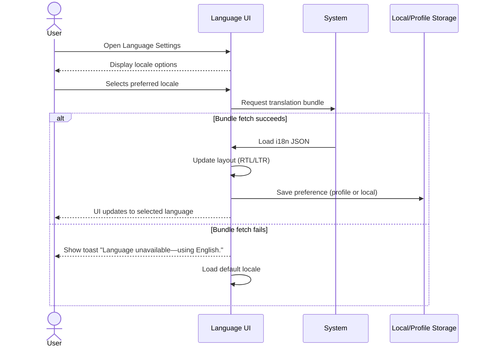

**Use-Case ID**: F.1
**Use-Case Title**: Localization / Language Switch
**Release**: MVP / Phase-2

## Core Scenario

**Primary actor**: Any authenticated or anonymous user
**Trigger event**: User accesses language settings or dropdown
**Pre-conditions**:

* App or site is loaded
* Translation bundle for the target language is available

## Main Success Flow

1. User opens **Settings › Language** (mobile) or clicks language dropdown (web).
2. System displays all supported locales (e.g., English, Dutch, French, Arabic-RTL).
3. User selects a locale.
4. System downloads the corresponding i18n JSON file.
5. Layout updates (RTL/LTR if required).
6. Preference is saved (profile if signed-in, local storage if guest).
7. Subsequent sessions load in the chosen language.

## Post-conditions

* Selected language is applied across UI.
* Preference persists between sessions.

## Standard Alternate / Error Paths

**A-1 – Bundle download fails**

* Condition: Selected language’s JSON bundle fails to load
* Expected behaviour: System falls back to default (English) and shows toast: “Language unavailable—using English.”

**A-2 – User clears cache**

* Condition: User clears browser/app storage
* Expected behaviour: App reverts to device default locale until re-selection.

## Edge & Stretch Scenarios

**E-1 – Connectivity (Stretch)**

* Scenario: Device goes offline during locale bundle fetch
* Release tag: Stretch

**E-2 – Permissions (Stretch)**

* Scenario: User denies location access on first launch
* Release tag: Stretch

**E-3 – Accessibility (Stretch)**

* Scenario: User switches to high-contrast mode during locale switch
* Release tag: Stretch

**E-4 – Performance (Stretch)**

* Scenario: Large translation payload slows UI rendering
* Release tag: Stretch

## Acceptance Criteria (Gherkin)

```gherkin
Given the app is loaded and translation bundles exist
When the user selects a different language from settings
Then the system updates UI language and saves the preference

Given bundle download fails
When the user selects a locale
Then the app shows fallback toast and reverts to default locale

Given user clears cache
When the app is reopened
Then the system loads the device locale until user re-applies setting
```

## Sequence Diagram


