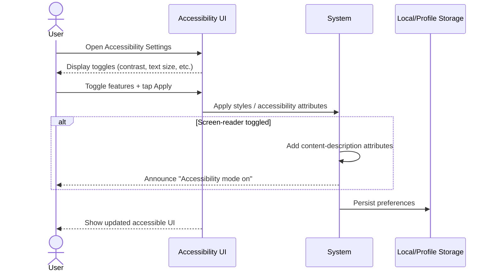

**Use-Case ID**: F.2
**Use-Case Title**: Accessibility Settings (contrast, font, screen-reader)
**Release**: MVP / Phase-2

## Core Scenario

**Primary actor**: Any user with accessibility needs
**Trigger event**: User accesses accessibility settings
**Pre-conditions**:

* App/site is running on an OS that exposes accessibility APIs (e.g., Android, Chromium)

## Main Success Flow

1. User opens **Settings › Accessibility**.
2. System displays available options:

   * High-Contrast Theme
   * Large Text
   * Screen-Reader Hints
   * Reduce Motion
3. User toggles one or more options and taps “Apply”.
4. System applies chosen settings immediately via CSS/style variable swaps or Android theme update.
5. If screen-reader mode is toggled, system enhances accessibility attributes and announces: “Accessibility mode on.”
6. Preferences are persisted locally or to user profile.

## Post-conditions

* Accessibility preferences are saved and applied immediately without app restart.

## Standard Alternate / Error Paths

**A-1 – OS High-Contrast Mode Detected**

* Condition: Device already in OS-level high-contrast mode
* Expected behaviour: App pre-checks toggle and aligns with system setting.

**A-2 – Large Text Not Supported**

* Condition: Device cannot render large text properly due to memory limits or layout constraints
* Expected behaviour: System shows warning and reverts to default text size.

## Edge & Stretch Scenarios

**E-1 – Connectivity (Stretch)**

* Scenario: Device goes offline during sync of accessibility preferences
* Release tag: Stretch

**E-2 – Permissions (Stretch)**

* Scenario: User denies location on first launch
* Release tag: Stretch

**E-3 – Accessibility (Stretch)**

* Scenario: User switches to high-contrast mid-ride
* Release tag: Stretch

**E-4 – Performance (Stretch)**

* Scenario: Applying styles or toggles causes noticeable lag on low-end device
* Release tag: Stretch

## Acceptance Criteria (Gherkin)

```gherkin
Given the user has opened the accessibility settings
When they toggle features and tap Apply
Then the system updates UI immediately and saves their preferences

Given the device is in high-contrast mode
When the user opens accessibility settings
Then the system pre-checks the high-contrast toggle

Given the device cannot render large text
When the user enables Large Text
Then the system shows a warning and disables the option
```

## Sequence Diagram


