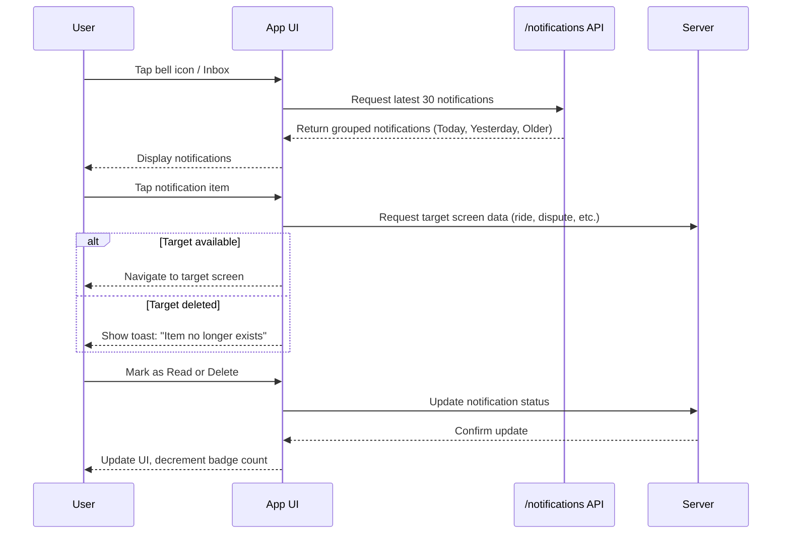

# F.3 Notifications Center (View & Dismiss Past Pushes) <MVP>

## Core Scenario

### Primary actor

Logged-in Rider, Driver, or Admin

### Trigger event

User taps bell icon (mobile) or Inbox (web)

### Pre-conditions

* Push/SMS/email events have been generated for the account

### Main success flow

**Step one**
System loads last 30 notifications from `/notifications` API, grouped by date (Today, Yesterday, Older).

**Step two**
Unread items are highlighted; user taps an item → system deep-links to the related screen (ride, dispute, promo).

**Step three**
User swipes (mobile) or ticks checkbox (web) → taps “Mark as Read” or “Delete”.
System updates read status server-side; badge count decrements in real time.

### Post-conditions

* Notification read/deletion status is updated server-side
* Badge count accurately reflects unread items

---

## Standard Alternate / Error Paths

### A-1

* **Condition / Branch**: No notifications yet
* **Expected behaviour**: System displays empty state illustration: “You’re all caught up!”

### A-2

* **Condition / Branch**: Deep-link target no longer exists
* **Expected behaviour**: App shows toast message: “Item no longer exists.”

---

## Edge & Stretch Scenarios

### E-1

* **Category**: Connectivity
* **Scenario**: Device goes offline during notification sync
* **Release tag**: Stretch

### E-2

* **Category**: Permissions
* **Scenario**: User denies location on first launch
* **Release tag**: Stretch

### E-3

* **Category**: Accessibility
* **Scenario**: Switch to high-contrast mid-session
* **Release tag**: Stretch

### E-4

* **Category**: Performance
* **Scenario**: Large payload arrives during sync
* **Release tag**: Stretch

---

## Acceptance-Criteria Stencil (G/W/T)

**Given** the user is logged in and has received notifications
**When** they tap the bell icon (mobile) or Inbox (web)
**Then** the system displays the last 30 notifications grouped by date

**Given** the user taps a notification
**When** the item still exists
**Then** it deep-links to the correct screen

**Given** the user deletes or marks notifications as read
**When** the server confirms update
**Then** the UI updates and badge count decreases

---

## Mermaid Sequence Diagram

