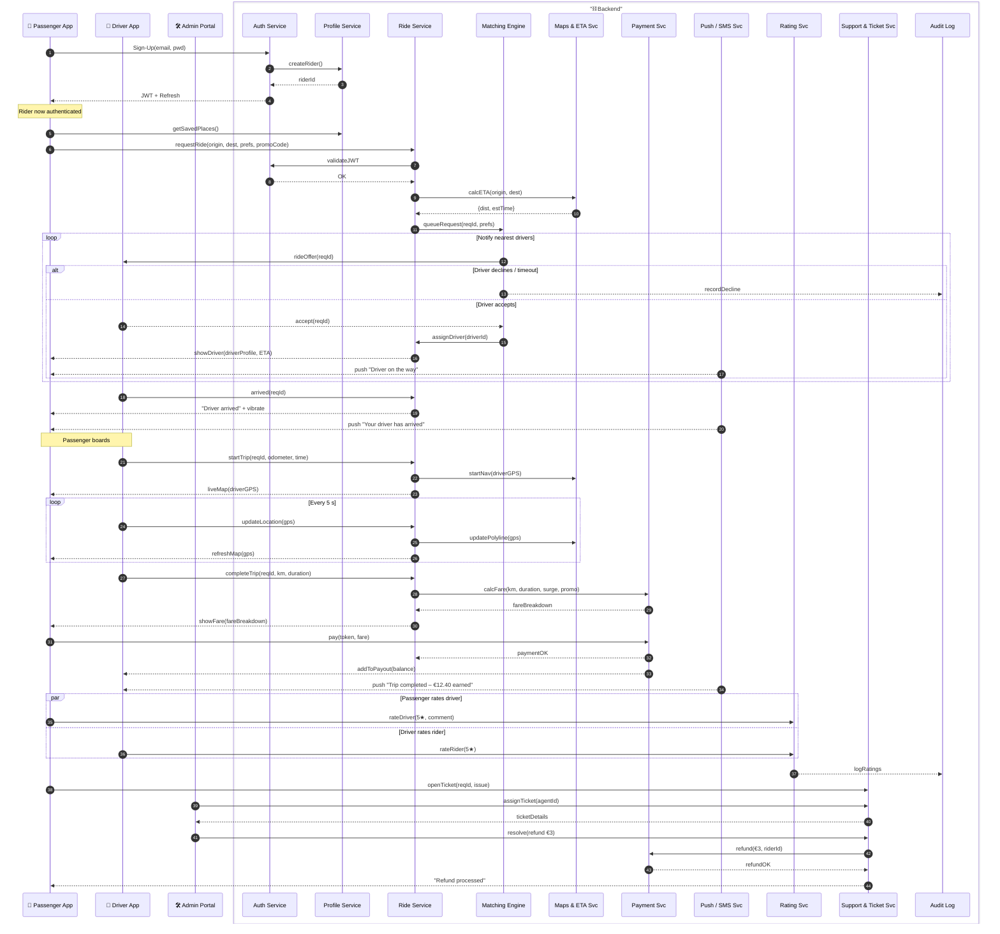

content = """
# Ride-Hailing Platform – End-to-End Sequence Diagram

This detailed sequence shows how **passenger**, **driver**, **admin**, and **backend micro-services** collaborate during a complete ride lifecycle.  
Icons & groupings make it friendlier for product owners and non-engineers.

---

## Legend
| Symbol | Actor / Service |
|--------|-----------------|
| 📱 | Passenger Mobile App |
| 🚗 | Driver Mobile App |
| 🛠️ | Admin / Back-Office Portal |
| ⛓️ Backend | Micro-services cluster (blue box) |

---

