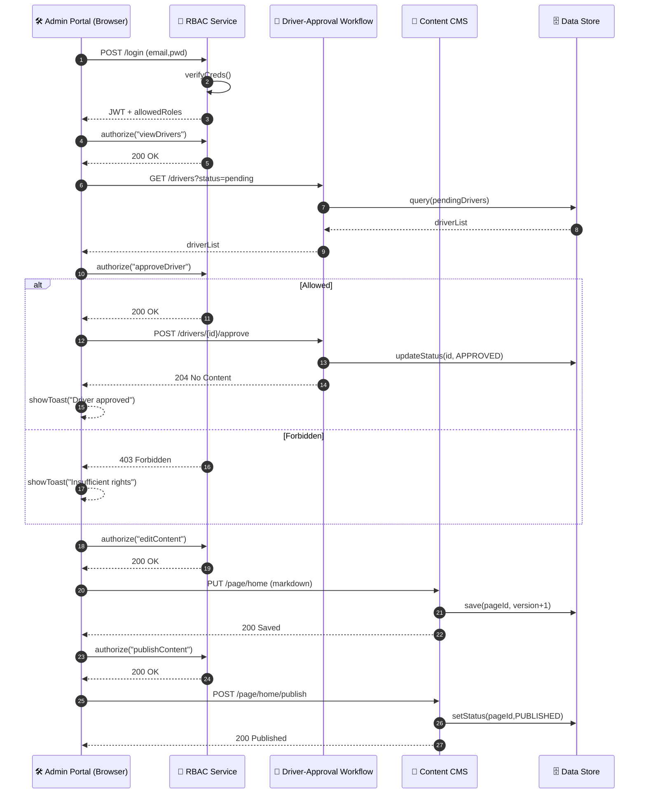

# Admin / Back‑Office Portal – Sequence Diagram

Covers three key slices of the back‑office platform: **RBAC Layer**, **Driver‑Approval Workflow**, and **Content CMS**.

---

### Component Responsibilities

| Component | Role |
|-----------|------|
| **RBAC Service** | AuthN/AuthZ, issues JWT with role claims, checks permissions per action |
| **Driver‑Approval Workflow** | Handles KYC docs, status transitions (PENDING → APPROVED/REJECTED) |
| **Content CMS** | Stores & publishes marketing pages, FAQs, banners; versioned edits |
| **Data Store** | Shared persistence (Postgres, S3, etc.) |
