# Admin / Back‑Office Portal – Sequence Diagram

Covers three key slices of the back‑office platform: **RBAC Layer**, **Driver‑Approval Workflow**, and **Content CMS**.

```mermaid
sequenceDiagram
    autonumber

    %% ===== Participants =====
    participant AdminUI as 🛠️ Admin Portal (Browser)
    participant Auth as 🔐 RBAC Service
    participant DriverWF as 🚗 Driver‑Approval Workflow
    participant CMS as 📄 Content CMS
    participant Store as 🗄️ Data Store

    %% ------------------------------------------------------------
    %% 0. Login & Permission Bootstrap
    %% ------------------------------------------------------------
    AdminUI->>Auth: POST /login (email,pwd)
    Auth->>Auth: verifyCreds()
    Auth-->>AdminUI: JWT + allowedRoles

    %% ------------------------------------------------------------
    %% 1. List Pending Drivers
    %% ------------------------------------------------------------
    AdminUI->>Auth: authorize("viewDrivers")
    Auth-->>AdminUI: 200 OK
    AdminUI->>DriverWF: GET /drivers?status=pending
    DriverWF->>Store: query(pendingDrivers)
    Store-->>DriverWF: driverList
    DriverWF-->>AdminUI: driverList

    %% ------------------------------------------------------------
    %% 2. Approve Driver
    %% ------------------------------------------------------------
    AdminUI->>Auth: authorize("approveDriver")
    alt Allowed
        Auth-->>AdminUI: 200 OK
        AdminUI->>DriverWF: POST /drivers/{id}/approve
        DriverWF->>Store: updateStatus(id, APPROVED)
        DriverWF-->>AdminUI: 204 No Content
        AdminUI-->>AdminUI: showToast("Driver approved")
    else Forbidden
        Auth-->>AdminUI: 403 Forbidden
        AdminUI-->>AdminUI: showToast("Insufficient rights")
    end

    %% ------------------------------------------------------------
    %% 3. Edit CMS Content
    %% ------------------------------------------------------------
    AdminUI->>Auth: authorize("editContent")
    Auth-->>AdminUI: 200 OK
    AdminUI->>CMS: PUT /page/home (markdown)
    CMS->>Store: save(pageId, version+1)
    CMS-->>AdminUI: 200 Saved

    %% ------------------------------------------------------------
    %% 4. Publish CMS Content
    %% ------------------------------------------------------------
    AdminUI->>Auth: authorize("publishContent")
    Auth-->>AdminUI: 200 OK
    AdminUI->>CMS: POST /page/home/publish
    CMS->>Store: setStatus(pageId,PUBLISHED)
    CMS-->>AdminUI: 200 Published
```

---

### Component Responsibilities

| Component | Role |
|-----------|------|
| **RBAC Service** | AuthN/AuthZ, issues JWT with role claims, checks permissions per action |
| **Driver‑Approval Workflow** | Handles KYC docs, status transitions (PENDING → APPROVED/REJECTED) |
| **Content CMS** | Stores & publishes marketing pages, FAQs, banners; versioned edits |
| **Data Store** | Shared persistence (Postgres, S3, etc.) |
