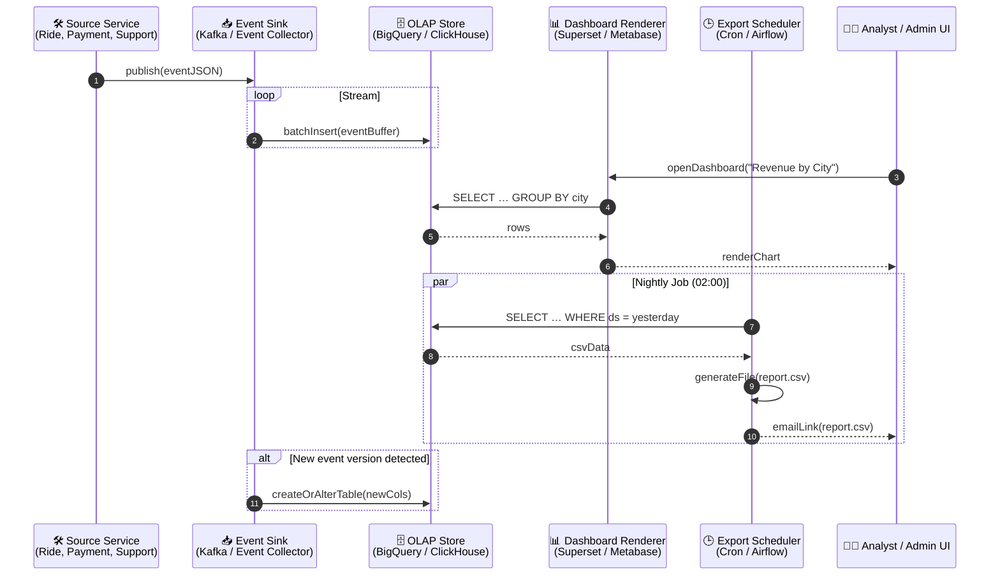

# Analytics & Reporting – Sequence Diagram

Illustrates how the **Event Sink**, **OLAP Store**, **Dashboard Renderer**, and **Export Scheduler** cooperate to provide near‑real‑time insights and scheduled reports.

---

### Component Responsibilities

| Component | Role |
|-----------|------|
| **Event Sink** | Buffers high‑volume events, batches writes to OLAP (minimises small inserts) |
| **OLAP Store** | Columnar analytics DB; supports fast aggregates and large scans |
| **Dashboard Renderer** | Interactive charts, SQL lab for analysts, caching |
| **Export Scheduler** | Cron / DAG tool; runs templated SQL, generates CSV/Parquet, emails or uploads to S3 |

Extend with data‑quality checks, incremental materialised views, or alert thresholds as needed.
