# Analytics & Reporting – Sequence Diagram

Illustrates how the **Event Sink**, **OLAP Store**, **Dashboard Renderer**, and **Export Scheduler** cooperate to provide near‑real‑time insights and scheduled reports.

```mermaid
sequenceDiagram
    autonumber

    %% ===== Participants =====
    participant Src   as 🛠️ Source Service<br/>(Ride, Payment, Support)
    participant Sink  as 📥 Event Sink<br/>(Kafka / Event Collector)
    participant OLAP  as 🗄️ OLAP Store<br/>(BigQuery / ClickHouse)
    participant Dash  as 📊 Dashboard Renderer<br/>(Superset / Metabase)
    participant Export as 🕒 Export Scheduler<br/>(Cron / Airflow)
    participant Admin as 🧑‍💼 Analyst / Admin UI

    %% ------------------------------------------------------------
    %% 1. Event Ingestion
    %% ------------------------------------------------------------
    Src->>Sink: publish(eventJSON)
    loop Stream
        Sink->>OLAP: batchInsert(eventBuffer)
    end

    %% ------------------------------------------------------------
    %% 2. Ad‑Hoc Dashboard Query
    %% ------------------------------------------------------------
    Admin->>Dash: openDashboard("Revenue by City")
    Dash->>OLAP: SELECT … GROUP BY city
    OLAP-->>Dash: rows
    Dash-->>Admin: renderChart

    %% ------------------------------------------------------------
    %% 3. Scheduled Export
    %% ------------------------------------------------------------
    par Nightly Job (02:00)
        Export->>OLAP: SELECT … WHERE ds = yesterday
        OLAP-->>Export: csvData
        Export->>Export: generateFile(report.csv)
        Export-->>Admin: emailLink(report.csv)
    end

    %% ------------------------------------------------------------
    %% 4. Schema Evolution (async)
    %% ------------------------------------------------------------
    alt New event version detected
        Sink->>OLAP: createOrAlterTable(newCols)
    end
```

---

### Component Responsibilities

| Component | Role |
|-----------|------|
| **Event Sink** | Buffers high‑volume events, batches writes to OLAP (minimises small inserts) |
| **OLAP Store** | Columnar analytics DB; supports fast aggregates and large scans |
| **Dashboard Renderer** | Interactive charts, SQL lab for analysts, caching |
| **Export Scheduler** | Cron / DAG tool; runs templated SQL, generates CSV/Parquet, emails or uploads to S3 |

Extend with data‑quality checks, incremental materialised views, or alert thresholds as needed.
