# Audit & Compliance – Sequence Diagram

This flow shows how the **Audit Log**, **Access‑Review Tool**, and **GDPR Erasure Workflow** cooperate to meet regulatory obligations (PCI, GDPR, ISO 27001).

```mermaid
sequenceDiagram
    autonumber

    %% ===== Participants =====
    participant Src   as 🛠️ Source Service<br/>(Ride/Payment/Admin)
    participant Audit as 📜 Audit Log Service
    participant Review as 🕵️‍♂️ Access‑Review Tool
    participant DPO   as 👩‍⚖️ Data‑Protection Officer
    participant GDPR  as 🗑️ GDPR Erasure Orchestrator
    participant Store as 🗄️ Data Stores

    %% ------------------------------------------------------------
    %% 1. Runtime Audit Event Ingestion
    %% ------------------------------------------------------------
    Src->>Audit: logEvent(userId, action, meta)
    Note over Audit: Append‑only, WORM storage

    %% ------------------------------------------------------------
    %% 2. Periodic Access Review
    %% ------------------------------------------------------------
    Review->>Audit: queryEvents(actor=adminId, since=30d)
    Audit-->>Review: resultSet
    Review-->>DPO: CSV export<br/>"admin-access-30d.csv"

    %% ------------------------------------------------------------
    %% 3. GDPR – Data Erasure Request
    %% ------------------------------------------------------------
    DPO->>GDPR: submitErasure(userId)
    GDPR->>Store: anonymizeOrDelete(userId)
    Store-->>GDPR: done
    GDPR->>Audit: redactEvents(userId)
    Audit-->>GDPR: redactOK
    GDPR-->>DPO: 200 Erasure Complete

    %% ------------------------------------------------------------
    %% 4. Retention Hold Edge‑Case
    %% ------------------------------------------------------------
    alt Legal hold active
        GDPR-->>DPO: 409 Cannot erase – under investigation
    end
```

---

### Component Responsibilities

| Component | Role |
|-----------|------|
| **Audit Log Service** | Write‑once event store; supports redact/retain policies; cryptographic hash chains |
| **Access‑Review Tool** | GUI/CLI for compliance audits; exports evidence packages |
| **GDPR Erasure Orchestrator** | Coordinates deletion/anonymisation across datastores & audit log; enforces retention windows |
| **Data Stores** | Domain DBs (Profile, Trips, Telemetry) implementing per‑table erasure hooks |

